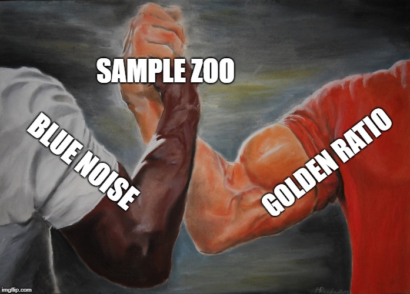



# Table of Contents

* [Progressive vs Non Progressive Samples](./doc/progressive.md)

## _1d Samples

 * [Blue Noise](output/_1d/samples/blue_noise/page.md) - Randomized sequences that have only high frequency content  
 * [Irrational Numbers](output/_1d/samples/irrational_numbers/page.md) - Multiply an irrational number by the squence index and take that mod 1 to make it be in [0,1)  
 * [LDS](output/_1d/samples/lds/page.md) - Low discrepancy sequences  
 * [Regular](output/_1d/samples/regular/page.md) - Uniformly spaced samples  
 * [Uniform Random](output/_1d/samples/uniform_random/page.md) - Randomized sample positions using a uniform random number distribution.  
## _1d Tests

 * [DFT](output/_1d/tests/dft/page.md) - Transforms sampling patterns into frequency space  
 * [Discrepancy](output/_1d/tests/discrepancy/page.md) - Calculate metrics about actual point density compared to expected point density if the points were uniformly spaced.  
 * [Integration](output/_1d/tests/integration/page.md) - Use sample points to integrate 1d functions  
 * [Numberline](output/_1d/tests/numberline/page.md) - Makes numberlines  
## _2d Samples

 * [Blue Noise](output/_2d/samples/blue_noise/page.md) - Randomized sequences that have only high frequency content  
 * [Irrational Numbers](output/_2d/samples/irrational_numbers/page.md) - Using irrational numbers to make 2d low discrepancy sequences  
 * [LDS](output/_2d/samples/lds/page.md) - Low discrepancy sequences  
 * [Regular](output/_2d/samples/regular/page.md) - Uniformly spaced samples  
 * [Uniform Random](output/_2d/samples/uniform_random/page.md) - Randomized sample positions using a uniform random number distribution.  
## _2d Tests

 * [DFT](output/_2d/tests/dft/page.md) - Transforms sampling patterns into frequency space  
 * [Integration](output/_2d/tests/integration/page.md) - Use sample points to integrate 2d functions  
 * [Plot](output/_2d/tests/plot/page.md) - Plots sequences  


# SampleZoo
Simple copy/paste-able implementations of sampling patterns, with objective and subjective tests to compare them, along with understandable explanations.

Created by Alan Wolfe
email: alan.wolfe@gmail.com
twitter: https://twitter.com/Atrix256

Building and running this code: [building](building.md)

Everything in this repository is under the [MIT License](LICENSE) unless otherwise stated in the source file.

Full list of contributors here: [credits](credits.md)

Information on how to contribute to this project: [contributing](contributing.md)

# Why Does This Exist??

My interest in sampling patterns is mainly for use in numerical integration techniques in real time graphics.  In that situation, you usually want a sequence that will converge with as few samples as possible, and give a pleasing error pattern when it hasn't fully converged.

This stuff is surprisingly nuanced, and new sampling techniques come out every year as researchers continue to push the envelope.

It can be hard to find implementations for some sampling patterns, especially if they are newly published.  Furthermore, each sampling paper seems to use different testing methods to show properties of their sequences, which can make it hard to compare against other sample sequences.

My goal is to get as many implemented and tested as possible, including new ones as they come out, so this stuff is more accessible and usable by the folks who could benefit from it.

It's a lot of work for one person though, so Sample Zoo need your help!

# Other Software Used

* **STB** - https://github.com/nothings/stb.  This is used to read and write images, and render true type text. Very cool set of header only libraries from Sean Barrett https://twitter.com/nothings.
* **Premake5** - a nice way to generate project and solution files from code.  Because premake scripts are lua, I also have the premake script call into the lua files that generate code and documentation - such as the table of contents page!  https://premake.github.io/
* **simple_fft** - https://github.com/d1vanov/Simple-FFT.  A header only library implementing the fast discrete fourier transform.  Used for frequency analysis.
