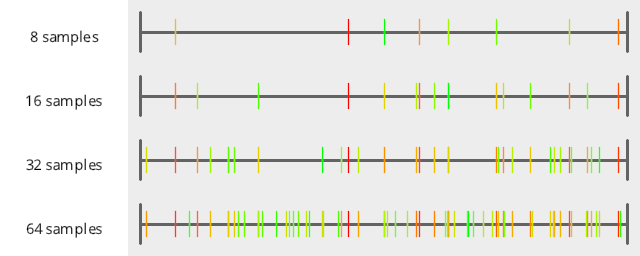

# What is Blue Noise?

Blue noise are numbers that are randomized, but roughly evenly spaced.
  

This is in contrast to regular old random numbers (white noise), which can clump together and leave empty regions.
  

For a non graphics oriented explanation of why that's useful and interesting, check this out: https://blog.demofox.org/2018/01/30/what-the-heck-is-blue-noise/

It's called blue noise because if you do a DFT to look at the frequency content, it's missing (or has attenuated) low frequencies, like blue light which is high frequency light.

  

Blue noise sampling also goes by the name "Poisson Disk Sampling" because it can be made in 2D by randomly placing fairly tightly packed disks, and using their center points as the sampling positions.  This is not to be confused with "Poisson Sampling" aka "Poisson Point Sampling" which is made by randomly placing points and is just white noise.

For graphics, blue noise has some interesting properties:
* pro - gives the least aliasing
* pro - very easy on the eyes and looks a lot better than other noise patterns with the same amount of error
* pro - has good coverage over the sampling space, so has good starting error
* pro - it leaves high frequency noise, which is more easily removed with a less powerful low pass filter (aka blur) compared to other noise patterns
* pro - the error pattern it leaves is roughly evenly spaced.  It is as though error diffusion has happened, even though you don't have to explicitly do error diffusion (great for real time graphics)
* con - integrates at the same rate as white noise (slowly), even though it starts at a lower error.
* con - can be computationally expensive to generate

Blue noise tends to tile well.  The lack of low frequency content makes it so there are no larger structures to catch your eye.

Many things in our world - natural and man made - are distributed in a blue noise pattern.  This includes the photoreceptors in your eyes, as well as foam in a tempurpedic matress (something which is unique to their process of making matresses, and patented).  "Randomized but roughly evenly spaced" turns out to be a fairly common property and is exactly what blue noise is.

Beyond graphics, I've heard of game designers using blue noise for things like loot drops or boss encountered.  White noise has too much clumping and repeating which make players say things like "I just got this loot last time. This isn't random at all!".  Blue noise gives you something different every time and so feels more random.  In that context, blue noise is a bit like a shuffle.

## When Should Blue Noise Be Used?

Blue noise has lower starting error than white noise but converges at the same rate.

Since "converged rendering" looks the same no matter how you got there, if you can afford enough samples to converge using blue noise, you should probably switch to something else that converges faster and use fewer samples.  

Conversely, if you aren't converging, but can reach convergence by switching to another sampling sequence for the same sample count, you should do that instead.

The power of blue noise comes up when you can't spare afford samples to converge.

The noise pattern left by blue noise is less jarring and less noticeable than white noise or things like low discrepancy sequences, and is more easily removed by denoising techniques such as a low pass filter (aka blur) due to the noise (error) being constrained to high frequencies.

Since I'm a real time graphics person, blue noise is very much my friend.  It allows me to get nice looking results with a very low sample count.

It's amazing what blue noise can accomplish at low sample counts, when doing apples to apples comparisons against other sampling strategies - most strikingly of all, compared to white noise which is painful to look at in comparison.

## Links:

Blue noise links from Mikkel Gjoel (https://twitter.com/pixelmager) of INSIDE fame  
https://gist.github.com/pixelmager/5d25fa32987273b9608a2d2c6cc74bfa  
https://blog.demofox.org/2018/01/30/what-the-heck-is-blue-noise/ - What the heck is blue noise?  
https://blog.demofox.org/2018/08/07/tiled-blue-noise/ - Tiled blue noise  
https://blog.demofox.org/2018/08/12/not-all-blue-noise-is-created-equal/ - Not All Blue Noise is Created Equal  
https://www.princeton.edu/news/2014/02/24/eye-chicken-new-state-matter-comes-view - In the eye of a chicken, a new state of matter comes into view  
https://blog.demofox.org/2017/10/31/animating-noise-for-integration-over-time/ - some visual examples comparing white noise to blue noise  
https://blog.demofox.org/2017/10/25/transmuting-white-noise-to-blue-red-green-purple/ - making various colors of noise
