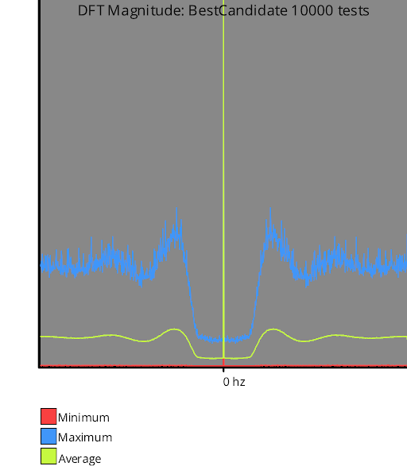

# Discrete Fourier Transform (DFT) Testing

The discrete Fourier transform transforms a sampling sequence into frequency space.  How this is done in each sample family varies, but the DFT test documentation for that sample family should explain the details.

Viewing the samples in frequency space can help you understand some properties of the sampling sequence.

For instance, blue noise is missing low frequency content, so you could see how jittered grid looks compared to blue noise in frequency space. They both are missing low frequency components, but look very different in frequency space despite this.

Below is the DFT of 1d blue noise made with the best candidate algorithm, and 1d jittered grid.

  

  