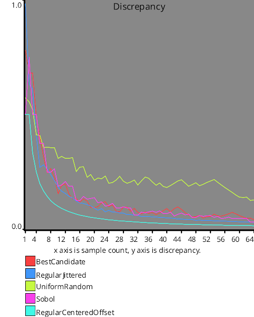
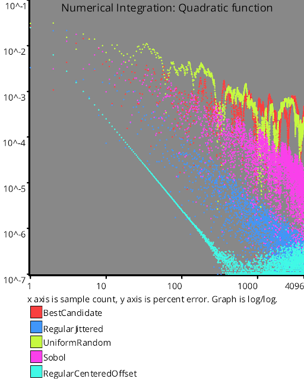

# Blue Noise Sequences
Source Code: [src/families/_1d/samples/blue_noise/](../../../../src/families/_1d/samples/blue_noise/)

Blue noise samples are randomized samples which are roughly evenly spaced.


It's called blue noise because if you do a DFT to look at the frequency content, it's missing (or has attenuated) low frequencies.


This gives blue noise good coverage over a sampling space, just like regular sampling does, but because the points are still randomized, blue noise doesn't have problems with aliasing like regular sampling dows.


Blue noise has lower starting error than white noise in numerical integration but integrates at the same rate as white noise.


There are low discrepancy sequences that integrate faster than either blue or white noise, but when blue noise sampling hasn't yet fully converged, the noise pattern remaining is visually pleasing due to the error being nearly evenly spaced.


Because of this, blue noise is a good choice for low sample counts, but for higher sample counts, low discrepancy sequences or white noise can be better choices.


There are many ways to generate blue noise sample points, but there currently is only one way implemented:

* BestCandidate()


The BestCandidate() function uses Mitchell's best candidate algorithm to iteratively generate a number of random candidates (white noise) and choose the candidate which has the best blue noise properties (largest distance from it's nearest neighbor).


The paper that describes the algorithm originally (in papers section below) says that that the number of candidates should scale up with the number of points you already have to keep consistent frequency content at different sample counts.  I've found that keeping the multiplier at 1.0 is best.


This algorithm generates a progressive sequence which means that if you generate N sample points, any subset of those sample points starting at 0 is also blue noise.  Also, you can add more sample points to an existing set of sample points, without having to throw out all the points you already made.


This property can be very useful for when you don't know how many samples you want to take in advance, or if you are using it for rendering, being able to preview the image as it renders and see something more representative of the final image.  With a non progressive sequence used in rendering, the image looks very bad until the end.


Blue noise sample points tend to tile well, even if they weren't designed to tile.  Their lack of low frequency content makes it so there are no larger structures to catch your eye.


Many things in our world - natural and man made - are distributed in a blue noise pattern.  This includes the photoreceptors in your eyes, as well as foam in a tempurpedic matress (something which is unique to their process of making matresses, and patented).  "Randomized but roughly evenly spaced" turns out to be a really common requirement of things, and in fact, if you have something in a game that doesn't feel random enough ("hey, i just fought one of those guys! This isn't random at all!"), the real randomness you might be looking for is blue noise, which doesn't repeat in the same way white noise does.  Despite this, it's still randomized and unpredictable.


# Comparison vs Other Sequences


  
  
  

# Links


https://blog.demofox.org/2017/10/20/generating-blue-noise-sample-points-with-mitchells-best-candidate-algorithm/ - Generating Blue Noise Sample Points With Mitchell’s Best Candidate Algorithm  
  
https://blog.demofox.org/2018/01/30/what-the-heck-is-blue-noise/ - What the heck is blue noise?  
  
https://blog.demofox.org/2018/08/07/tiled-blue-noise/ - Tiled blue noise  
  
https://blog.demofox.org/2018/08/12/not-all-blue-noise-is-created-equal/ - Not All Blue Noise is Created Equal  
  
https://www.princeton.edu/news/2014/02/24/eye-chicken-new-state-matter-comes-view - In the eye of a chicken, a new state of matter comes into view  
  

# Papers


http://citeseerx.ist.psu.edu/viewdoc/download?doi=10.1.1.556.445&rep=rep1&type=pdf - "Spectrally Optimal Sampling for Distribution Ray Tracing" by Don P. Mitchell 1991
# Test Results

 samples tested:

* BestCandidate (Progressive, Randomized)

* BestCandidate5 (Progressive, Randomized)

* BestCandidate10 (Progressive, Randomized)

* BestCandidateRefined (Not Progressive, Randomized)

## BestCandidate

### Discrete Fourier Transform

  
### Numberline

  
## BestCandidate5

### Discrete Fourier Transform

  
### Numberline

  
## BestCandidate10

### Discrete Fourier Transform

  
### Numberline

  
## BestCandidateRefined

### Discrete Fourier Transform

  
### Numberline

  
## Discrepancy Test

  
## Numerical Integration

### Linear

  
### Step

  
### Exp

  
### Quadratic

  
