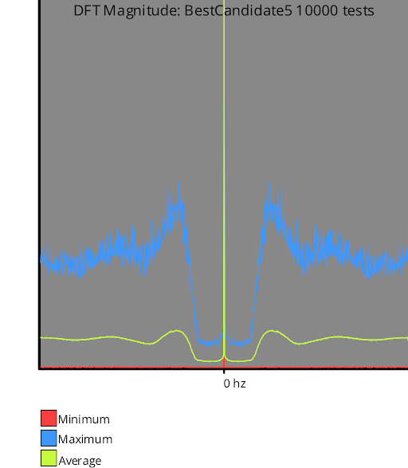
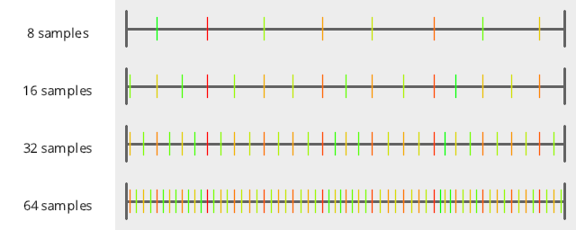
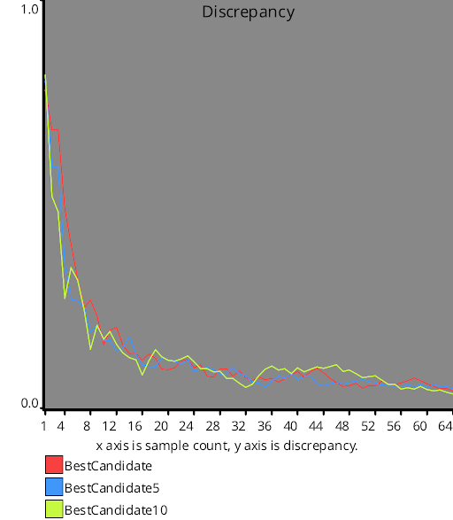
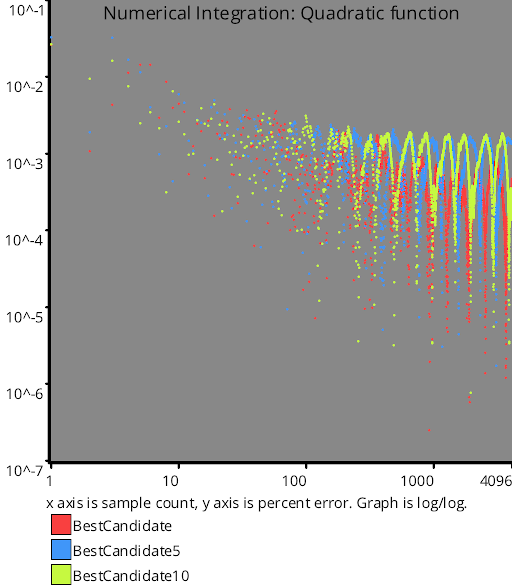

# Test Results
 samples tested:
* BestCandidate (Progressive, Randomized)
* BestCandidate5 (Progressive, Randomized)
* BestCandidate10 (Progressive, Randomized)
## BestCandidate
### Discrete Fourier Transform
  
### Numberline
  
## BestCandidate5
### Discrete Fourier Transform
  
### Numberline
  
## BestCandidate10
### Discrete Fourier Transform
  
### Numberline
  
## Discrepancy Test
  
## Numerical Integration
### Linear
  
### Step
  
### Exp
  
### Quadratic
  
