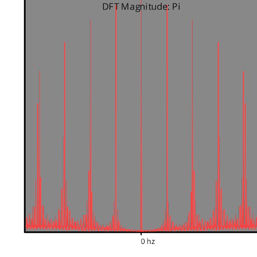
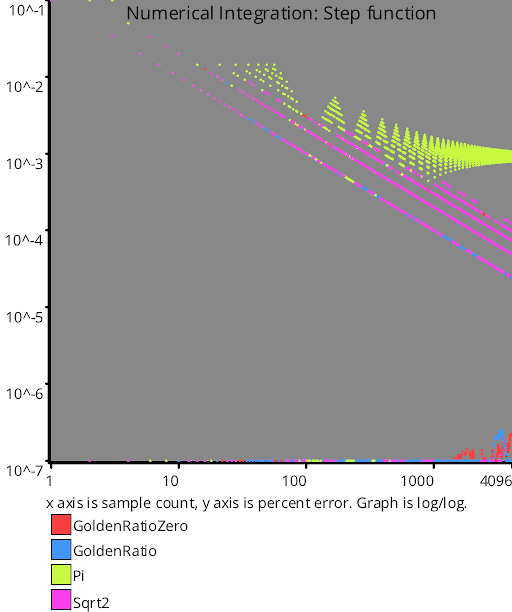
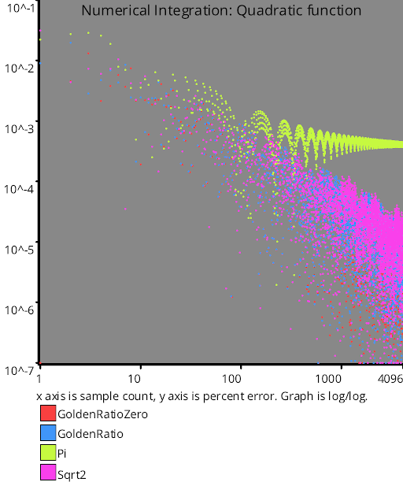

# Irrational Number Sampling
Source Code: [source code](../../../../families/_1d/samples/irrational_numbers/)
## Rational Numbers


Before we talk about using irrational numbers for generating sample points, let's talk about using rational numbers and start with the rational number 1/4.


To use rational numbers to make sample points, you just multiply the sample index by the rational number to get the sample point value.  Doing that, the first 4 samples (index 0,1,2,3) you get are:


0, 1/4, 2/4, 3/4


That gave us regularly spaced sampling.


We could continue the series, but since we are sampling in [0,1), we use modulus to keep it in that range, and end up repeating the pattern over and over.  Here are 16 samples:


0, 1/4, 2/4, 3/4, 0, 1/4, 2/4, 3/4, 0, 1/4, 2/4, 3/4, 0, 1/4, 2/4, 3/4


Let's see what happens if we use 3/4.  Here are the first 4 samples:


0, 3/4, 2/4, 1/4


It's in a different pattern this time. It's still uniform sampling but the samples are in a different order.


If we take it to 16 samples, it still repeats every 4 samples though:


0, 3/4, 2/4, 1/4, 0, 3/4, 2/4, 1/4, 0, 3/4, 2/4, 1/4, 0, 3/4, 2/4, 1/4


Let's change it up a bit and use a value of 3/5.  Here are 16 samples:


0, 3/5, 1/5, 4/5, 2/5, 0, 3/5, 1/5, 4/5, 2/5, 0, 3/5, 1/5, 4/5, 2/5, 0


This sequence repeats every 5 samples.


Here are 16 samples using 2/3:


0, 2/3, 1/3, 0, 2/3, 1/3, 0, 2/3, 1/3, 0, 2/3, 1/3, 0, 2/3, 1/3, 0


That sequence repeats every 3 samples.


You might think that the pattern is that the denominator determines how long it takes for the pattern to repeat, but here's 16 samples of 2/4:


0, 2/4, 0, 2/4, 0, 2/4, 0, 2/4, 0, 2/4, 0, 2/4, 0, 2/4, 0, 2/4


That repeats every 2 samples, not every 4!


If you reduce the fraction 2/4 you get 1/2, which may help explain why we saw it repeating every 2 samples.


So, the rule is, if you have a reduced fraction, the denominator is what determines how long it takes for the sequence to repeat.


A little more formally, if you have two numbers A and B, and they are coprime (they don't have any common divisors except 1), then using the rational number A/B to generate a sequence will repeat after B steps.


The formula for calculating sample I is this:  (I * A / B) mod 1


### Quick Tangent - Fast and Cheap Shuffles


If you ever find yourself in the need of a fast and cheap shuffle, a variation of this technique might be for you.


How it works is if the number of items you need to shuffle is N, you take any coprime number to that M as your "shuffle seed".  Choosing different values of M will result in different shuffles.


To get item I in the shuffle you just calculate this:  (I * M) mod N


Here's an example shuffling 10 things using a shuffle seed of 7:

0,7,4,1,8,5,2,9,6,3


Here's an example shuffling 10 things using a shuffle seed of 3:

0,3,6,9,2,5,8,1,4,7


The resulting number is the index to use in the array at step I, so an upside is that you don't actually need to do a shuffle, or stored a shuffled list.


A downside is that not all shuffle orders are possible, and are limited by how many possible M values there are (which is less than N).  If you were to shuffle 10 things, the only shuffle seeds you have available (numbers coprime to 10) are: 1,3,7,9. 1 and 9 make for some pretty predictable shuffles, and 3 and 7 are very related to eachother as you might have noticed in the examples above.  Despite this, it can work well in a pinch, cache friendliness aside.


This can also be used as a "random number generator" but i put it in quotes because it's so low quality, it isn't very often useful even in game development, which has much lower needs than cryptographic random numbers.  Definitely don't use this as a white noise generator for monte carlo integration or anything like that!!


## Irrational Numbers


Irrational numbers are numbers that can't be written as fractions (aka ratios. that's what rational is referring to, not the numbers decision making abilities).


Since the denominator of the reduced fraction is what defines how long the sequence takes to repeat, and irrational numbers have no denominator, you might come to the conclusion that they don't ever repeat - and you'd be right!


The formula for using irrational numbers is essentially the same as when using rational numbers.  If X is the irrational number and you want to calculate sample I, it's: (I * X) mod 1


That can make for a great number sequence like the below, which uses the square root of two (which is an irrational number) in that formula:


  

Just because a number is irrational doesn't make it a good choice though.  Here is pi:


  

The reason for this is that the square root of two is more irrational than pi, meaning you can get closer to the real value of pi with a fraction than you can to the square root of two.


The most irrational number of all is the golden ratio, which is approximately 1.61803398875.  Here is the golden ratio:


  

## More About the Golden Ratio


The golden ratio is mathematically proven as the most irrational number which is pretty cool (check the numberphile video in the links section for details of that) and has a value of approximately 1.61803398875.  It commonly goes by φ in equations (phi).


The golden ratio is linked to the Fibonacci sequence in that if you divide the N+1th Fibonacci sequence number by the Nth, you'll get a number that gets closer and closer to the golden ratio as N gets bigger.  At infinity (the limit), it is the golden ratio.


Another way to calculate the golden ratio is to solve this equation for x:  x^2=x+1


Something interesting about using the golden ratio to make 1d sample points in [0,1) is that each new sample point appears in the largest existing gap.  It cuts this gap into two sections too, where the size of one vs the other is the golden ratio.


Lastly, in the code, you'll see mention of the "golden ratio conjugate" which is 0.61803398875 instead of 1.61803398875 like the golden ratio.  It's true that this value is the golden ratio mod 1, but something more amazing is that this is also one divided by golden ratio, which is why it's called the conjugate.


Since irrational numbers can't be written as a fraction, you can take the reciprocal of an irrational number to get another irrational number that is just as irrational as the first one.


With the golden ratio being the provably most irrational number, the fact that the reciprocal is the exact same number after the decimal point shouldn't be too surprising, but it does give us another way to calculate it.  Solve for x:  1/x = x-1


It turns out you can use algebra to turn that equation into the previous one, but still a bit interesting I think.


The golden ratio is a pretty useful thing, and appears in many other sampling situations besides this simple 1d case.


## Links


The Golden Ratio (why it is so irrational) - Numberphile  
  
This shows how/why the golden ratio is so irrational, and why pi is not.  
  
https://www.youtube.com/watch?v=sj8Sg8qnjOg


The Unreasonable Effectiveness of Quasirandom Sequences  
  
This talks about a lot of really interesting things, but also generalizes the golden ratio in an interesting way.  
  
http://extremelearning.com.au/unreasonable-effectiveness-of-quasirandom-sequences/


How to Generate Random Colors Programmatically

This shows how to use the golden ratio to generate N colors from index [0,N) where the colors are nearly maximally different from eachother.  This technique is used in SampleZoo in fact, to do things like come up with the colors for lines in a line graph!

https://martin.ankerl.com/2009/12/09/how-to-create-random-colors-programmatically/
# Test Results

 samples tested:

* GoldenRatioZero (Progressive, Not Randomized)

* GoldenRatio (Progressive, Not Randomized)

* Pi (Progressive, Not Randomized)

* Sqrt2 (Progressive, Not Randomized)

## GoldenRatioZero

### Discrete Fourier Transform

  
### Numberline

  
## GoldenRatio

### Discrete Fourier Transform

  
### Numberline

  
## Pi

### Discrete Fourier Transform

  
### Numberline

  
## Sqrt2

### Discrete Fourier Transform

  
### Numberline

  
## Discrepancy Test

### CalculateDiscrepancy

  
### CalculateDiscrepancyWrapAround

  
## Numerical Integration

### Linear

  
### Step

  
### Exp

  
### Quadratic

  
