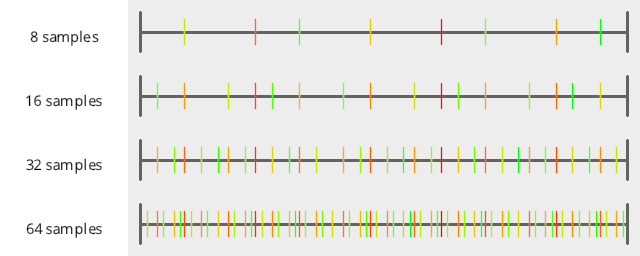

# Test Results
 samples tested:
* GoldenRatioZero (Progressive, Not Randomized)
* GoldenRatio (Progressive, Not Randomized)
* Pi (Progressive, Not Randomized)
* Sqrt2 (Progressive, Not Randomized)
## GoldenRatioZero
### Numberline
  
## GoldenRatio
### Numberline
  
## Pi
### Numberline
  
## Sqrt2
### Numberline
  
## Discrepancy Test
### CalculateDiscrepancy
  
### CalculateDiscrepancyWrapAround
  
## Numerical Integration
### Linear
  
### Step
  
### Exp
  
### Quadratic
  
