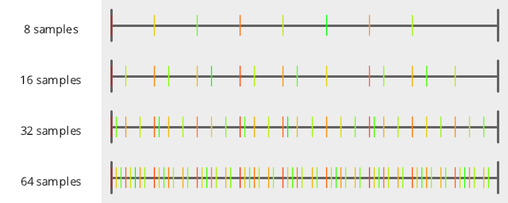
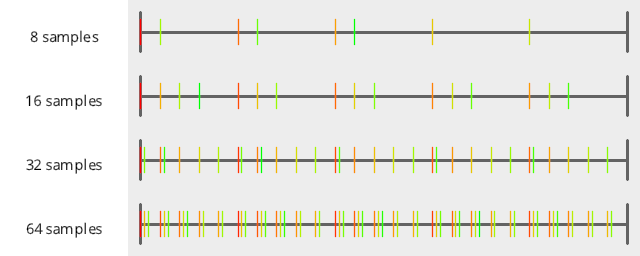
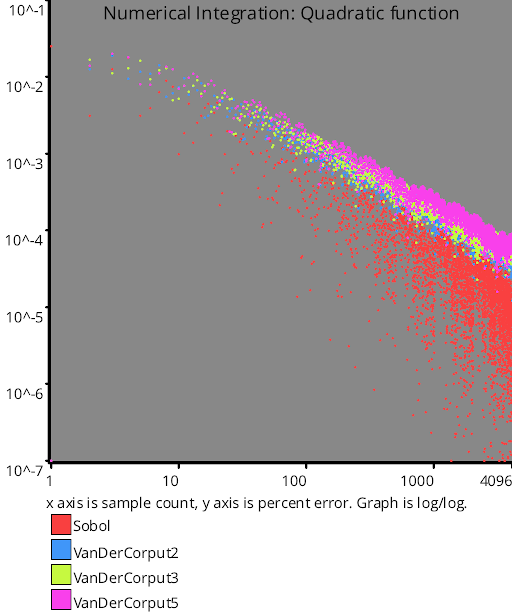

# Low Discrepancy Sequences
Low discrepancy sequences are deterministic (not randomized) number sequences that are low discrepancy - meaning the points tend not to clump together and leave holes.

Check the discrepancy test documentation for more information about what discrepancy is and how it's measured.

There are two low discrepancy sequences implemented currently:
 * Van Der Corput
 * Sobol

## Van Der Corput

The Van der Corput sequence is the 1d equivelant of the Halton sequence which just generalizes Van Der Corput to higher dimensions.

How you generate values in the VDC sequence is you first convert the index of your sample into some base.

For instance, if it was base 2, you would convert your index to binary. If it was base 16, you would convert your index to hexadecimal.

Now, instead of each digit of your number representing base B to some positive power - like for a 3 digit number in any base B, the digits mean: B^2 B^1 B^0 - you treat them as representing the base B to a negative power: B^-3, B^-2 B^-1.

That is all there is to it.

Picking a good base can be tricky.  Small prime numbers work pretty well.  Here are numberlines to show you base 2, base 3 and base 5.

  
  
  

Note how base 5 is lower quality than the others. 5 is not a very good choice for a base for 1d sequences and in the tests below, you can see that it has a larger discrepancy than the others and also is not as good for numerical integration.

Something else interesting is that if you look at van der corput base 2, the first few samples are: 0, 1/2, 1/4, 3/4, 1/8, 3/8, 5/8, 7/8.  You can kind of see how if you were using this for numerical integration that it's a sort of "binary search" through the space.  For this reason, VDC base 2 is a pretty good choice for some usage case.

Something not so great about VDC however is that while it is a progressive sequence (you can generate an infinite number of samples, and any sub-sequence from 0 to N is also low discrepancy), as you get to higher sample counts, it takes more and more samples to span the gap between 0 and 1.

Looking at base 2 again, ignoring 0, it takes 1 sample to go from 0 to 1 with the subsequence: 1/2.

Next, it takes 2 samples to go from 0 to 1 with the subsequence: 1/4, 3/4.

It then take 4 samples with: 1/8, 3/8, 5/8, 7/8.

In some usage cases this can be a problem.  For instance, if using a large sample count of VDC to sample something that is being put into a leaky integrator (a moving average), such as what you'd find in TAA, the quality of your result depends on your samples going through the sampling space quickly enough to keep the imperfect average more correct.  As the sample counts get higher, VDC moves through the sampling space more slowly, so can gum things up.  A golden ratio (irrational number) based sampling sequence on the other hand would do really well in this case however, because it ALWAYS takes the same number of samples to go through the full sampling space, no matter where you are in the sequence.

Lastly, I wanted to mention that VDC actually hits the same points that regular sampling does for the same number of samples (assuming it's able to finish a subsequence from 0 to 1), but it visits those sample points in a different order while also becoming a progressive sequence.

Because of this, VDC can have problems with aliasing just like regular sampling can.

## Sobol

Sobol is another low discrepancy sequence that actually performs really well for many tasks.

Sobol is actually just the Van Der Corput sequence base 2 re-arranged a little bit (but generated differently).  This means it has some ties to regular sampling as well, except that the sample re-arrangement is such that it's sufficiently different from regular sampling to have unique properties.

Here is how you generate numbers in the Sobol sequence:
* Calculate the Ruler function value for the current sample’s index(more info in a second)
* Make the direction vector by shifting 1 left (in binary) 31 – ruler times.
* XOR the last sample by the direction vector to get the new sample
* To interpret the sample as a floating point number you divide it by 2^32

TODO: continue!

## links

https://blog.demofox.org/2017/05/29/when-random-numbers-are-too-random-low-discrepancy-sequences/ - When Random Numbers Are Too Random: Low Discrepancy Sequences
# Test Results
 samples tested:
* Sobol (Progressive, Not Randomized)
* VanDerCorput2 (Progressive, Not Randomized)
* VanDerCorput3 (Progressive, Not Randomized)
* VanDerCorput5 (Progressive, Not Randomized)
## Sobol
### Discrete Fourier Transform
  
### Numberline
  
## VanDerCorput2
### Discrete Fourier Transform
  
### Numberline
  
## VanDerCorput3
### Discrete Fourier Transform
  
### Numberline
  
## VanDerCorput5
### Discrete Fourier Transform
  
### Numberline
  
## Discrepancy Test
### CalculateDiscrepancy
  
### CalculateDiscrepancyWrapAround
  
## Numerical Integration
### Linear
  
### Step
  
### Exp
  
### Quadratic
  
