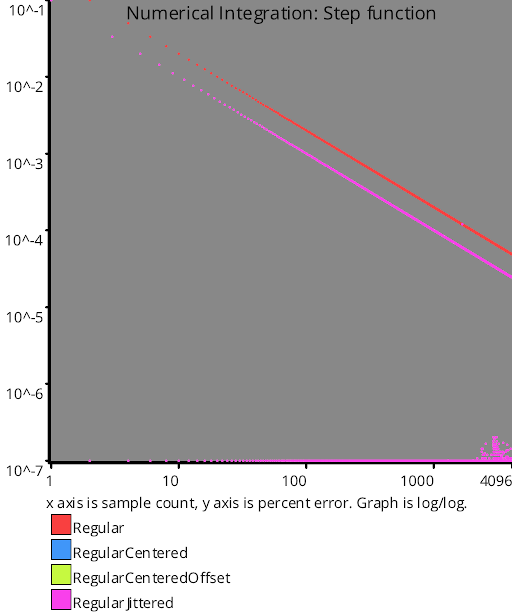
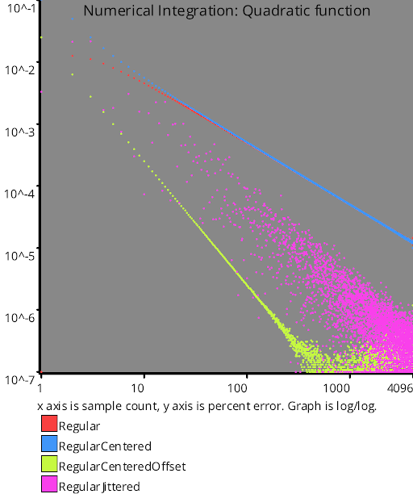

# Test Results
 samples tested:
* Regular (Not Progressive, Not Randomized)
* RegularCentered (Not Progressive, Not Randomized)
* RegularCenteredOffset (Not Progressive, Not Randomized)
* RegularJittered (Not Progressive, Randomized)
## Regular
### Discrete Fourier Transform
  
### Numberline
  
### Shuffle Test
#### Histogram
  
#### Values
  
## RegularCentered
### Discrete Fourier Transform
  
### Numberline
  
### Shuffle Test
#### Histogram
  
#### Values
  
## RegularCenteredOffset
### Discrete Fourier Transform
  
### Numberline
  
### Shuffle Test
#### Histogram
  
#### Values
  
## RegularJittered
### Discrete Fourier Transform
  
### Numberline
  
### Shuffle Test
#### Histogram
  
#### Values
  
## Discrepancy Test
### CalculateDiscrepancy
  
### CalculateDiscrepancyWrapAround
  
## Numerical Integration
### Linear
  
### Step
  
### Exp
  
### Quadratic
  
