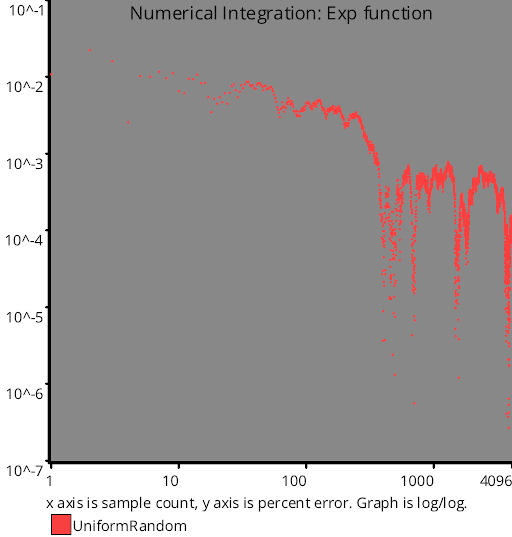

# Uniform Random Number Sampling
Source Code: [src/families/_1d/samples/uniform_random/](../../../../src/families/_1d/samples/uniform_random/)

Uniform random sampling uses random numbers to make sample positions.

It's called uniform because it uses a uniform distribution of random numbers.

This is also known as "white noise" because if you look at the DFT, it has equal probability of having amplitudes in all frequencies.

This is in contrast to blue noise which only has high frequency content or red noise which only has low frequency content.

Uniform random sampling doesn't have the aliasing problems that regular sampling does, but instead introduces noise, which is an acceptable trade off.

A problem with white noise is that the point locations are completely random without regard to any of the other point locations, which means that white noise samples can clump together and leave holes.

The end result is that uniform random sampling is not very quick at numerical integration, and before it converges it can have a very noticeable and jarring noise pattern.

Here are 16 samples of uniform random samples:



Blue noise is an alternative to uniform random sampling which has many of the positive characteristics of white noise, but has a better error rate at lower sample counts, and the noise pattern it leaves is more pleasing to the eye due to being more uniformly distributed.

# Test Results
 samples tested:
* UniformRandom (Progressive, Randomized)
## UniformRandom
### Discrete Fourier Transform
  
### Numberline
  
## Discrepancy Test
### CalculateDiscrepancy
  
### CalculateDiscrepancyWrapAround
  
## Numerical Integration
### Linear
  
### Step
  
### Exp
  
### Quadratic
  
