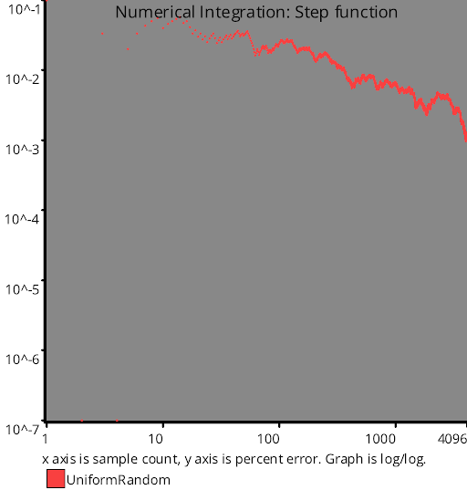

# Test Results
 samples tested:
* UniformRandom (Progressive, Randomized)
## UniformRandom
### Numberline
  
## Discrepancy Test
### CalculateDiscrepancy
  
### CalculateDiscrepancyWrapAround
  
## Numerical Integration
### Linear
  
### Step
  
### Exp
  
### Quadratic
  
