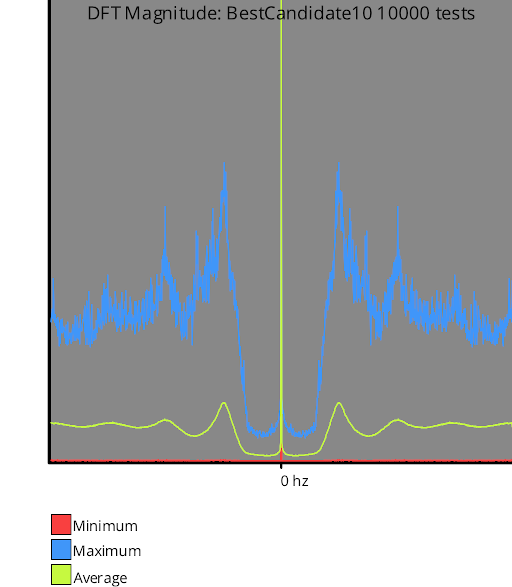
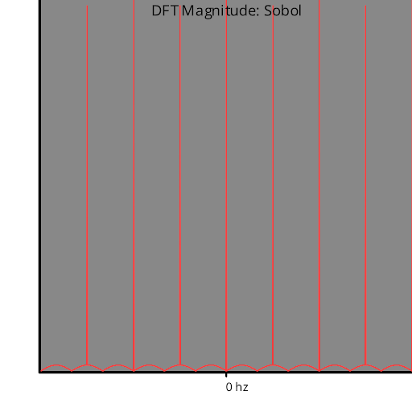
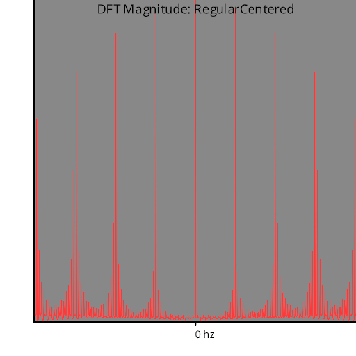

# Discrete Fourier Transform
Source Code: [/src/families/_1d/tests/dft/](../../../../src/families/_1d/tests/dft/)

The discrete Fourier transform transforms a sampling sequence into frequency space.

The test generates 128 samples and places them as black dots in a 1024x1 white image, and does a DFT of that image.

For randomized sampling types, it does this test several times and reports the minimum, the maximum, and the average.  Deterministic sampling sequences just do a single run.

There is no difference in this test for progressive vs non progressive sequences since it only ever generates a single 128 length sequence per sequence type.

No windowing function is used (TODO: use a windowing function?)

# Test Results
 tests done:
* DFT
## DFT
### Blue Noise Sequences
#### BestCandidate (Progressive, Randomized)
  
#### BestCandidate5 (Progressive, Randomized)
  
#### BestCandidate10 (Progressive, Randomized)
  
#### BestCandidateRefined (Not Progressive, Randomized)
  
### Irrational Number Sampling
#### GoldenRatioZero (Progressive, Deterministic)
  
#### GoldenRatio (Progressive, Deterministic)
  
#### Pi (Progressive, Deterministic)
  
#### Sqrt2 (Progressive, Deterministic)
  
### Low Discrepancy Sequences
#### Sobol (Progressive, Deterministic)
  
#### VanDerCorput2 (Progressive, Deterministic)
  
#### VanDerCorput3 (Progressive, Deterministic)
  
#### VanDerCorput5 (Progressive, Deterministic)
  
### Regular Sampling
#### Regular (Not Progressive, Deterministic)
  
#### RegularCentered (Not Progressive, Deterministic)
  
#### RegularCenteredOffset (Not Progressive, Deterministic)
  
#### RegularJittered (Not Progressive, Randomized)
  
### Uniform Random Number Sampling
#### UniformRandom (Progressive, Randomized)
  
