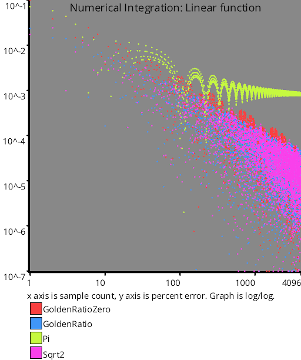
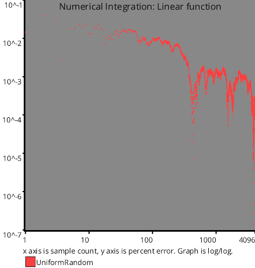
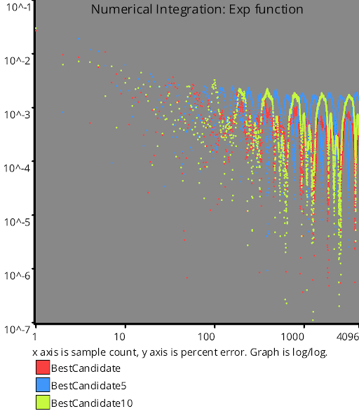

# Numerical Integration
Source Code: [/src/families/_1d/tests/integration/](../../../../src/families/_1d/tests/integration/)

Numerical integration is what this site is all about really, so this test is pretty important.

If you have a function y=f(x) and you want to know what the area of the graph is from 0 to W, one way to do it is to take N samples of the function (plug N different values of x in to get N values of y out), where the samples are between 0 and W, and then average them.

This average gives you an "average height" of the graph from 0 to W, so to get the area under the graph, you can now treat it like a rectangle where that value is the height, and W is the width.  Multiply them together and you have an estimate for the area under the graph.

A common way to sample is to use random numbers (white noise). When you do this, it's called monte carlo integration.

You can use other sampling types though as well, such as low discrepancy sequences, and can still provably have your estimate head towards the right answer, and provably do so faster than white noise (more accuracy for the same number of samples).

When the error is low enough, you can say that it has converged.

This test uses each sampling type to try and integrate the following functions from 0 to 1:
* Linear: y = x
* Step: y = (x > 0.5) ? 1.0 : 0.0
* Exp: y = e^x
* Quadratic: y=3x^2+2x+1

## links

https://blog.demofox.org/2018/06/12/monte-carlo-integration-explanation-in-1d/ - Monte Carlo Integration Explanation in 1D.

# Test Results
 tests done:
* Linear
* Step
* Exp
* Quadratic
## Linear
### Blue Noise Sequences
  
### Irrational Number Sampling
  
### Low Discrepancy Sequences
  
### Regular Sampling
  
### Uniform Random Number Sampling
  
## Step
### Blue Noise Sequences
  
### Irrational Number Sampling
  
### Low Discrepancy Sequences
  
### Regular Sampling
  
### Uniform Random Number Sampling
  
## Exp
### Blue Noise Sequences
  
### Irrational Number Sampling
  
### Low Discrepancy Sequences
  
### Regular Sampling
  
### Uniform Random Number Sampling
  
## Quadratic
### Blue Noise Sequences
  
### Irrational Number Sampling
  
### Low Discrepancy Sequences
  
### Regular Sampling
  
### Uniform Random Number Sampling
  
