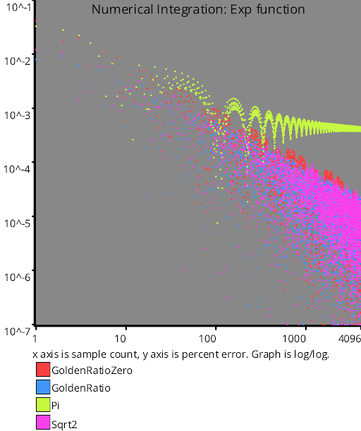
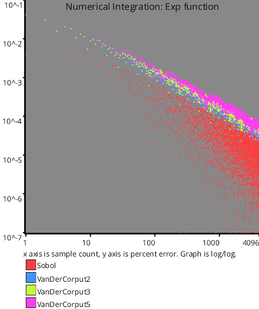

# Numerical Integration

# Test Results
 tests done:
* Linear
* Step
* Exp
* Quadratic
## Linear
### Blue Noise Sequences
  
### Irrational Number Sampling
  
### Low Discrepancy Sequences
  
### Regular Sampling
  
### Uniform Random Number Sampling
  
## Step
### Blue Noise Sequences
  
### Irrational Number Sampling
  
### Low Discrepancy Sequences
  
### Regular Sampling
  
### Uniform Random Number Sampling
  
## Exp
### Blue Noise Sequences
  
### Irrational Number Sampling
  
### Low Discrepancy Sequences
  
### Regular Sampling
  
### Uniform Random Number Sampling
  
## Quadratic
### Blue Noise Sequences
  
### Irrational Number Sampling
  
### Low Discrepancy Sequences
  
### Regular Sampling
  
### Uniform Random Number Sampling
  
