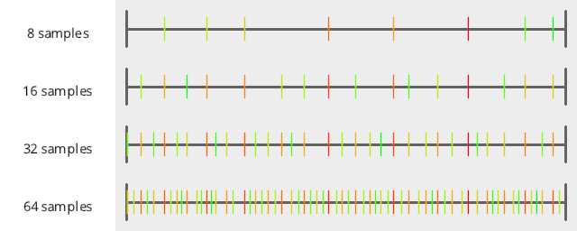
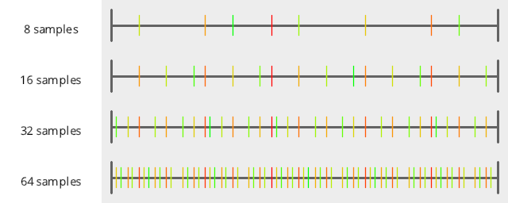

# Numberline
Source Code: [/src/families/_1d/tests/numberline/](../../../../src/families/_1d/tests/numberline/)

The MakeNumberline() function makes a numberline image from the samples you give it, and writes it to disk as a png, with the specified filename.

The first sample is red and the last sample is green. This lets you see the order of the samples on the numberline.
# Test Results
 tests done:
* MakeNumberline
## MakeNumberline
### Blue Noise Sequences
#### BestCandidate (Progressive, Randomized)
  
#### BestCandidate5 (Progressive, Randomized)
  
#### BestCandidate10 (Progressive, Randomized)
  
#### BestCandidateRefined (Not Progressive, Randomized)
  
### Irrational Number Sampling
#### GoldenRatioZero (Progressive, Deterministic)
  
#### GoldenRatio (Progressive, Deterministic)
  
#### Pi (Progressive, Deterministic)
  
#### Sqrt2 (Progressive, Deterministic)
  
### Low Discrepancy Sequences
#### Sobol (Progressive, Deterministic)
  
#### VanDerCorput2 (Progressive, Deterministic)
  
#### VanDerCorput3 (Progressive, Deterministic)
  
#### VanDerCorput5 (Progressive, Deterministic)
  
### Regular Sampling
#### Regular (Not Progressive, Deterministic)
  
#### RegularCentered (Not Progressive, Deterministic)
  
#### RegularCenteredOffset (Not Progressive, Deterministic)
  
#### RegularJittered (Not Progressive, Randomized)
  
### Uniform Random Number Sampling
#### UniformRandom (Progressive, Randomized)
  
