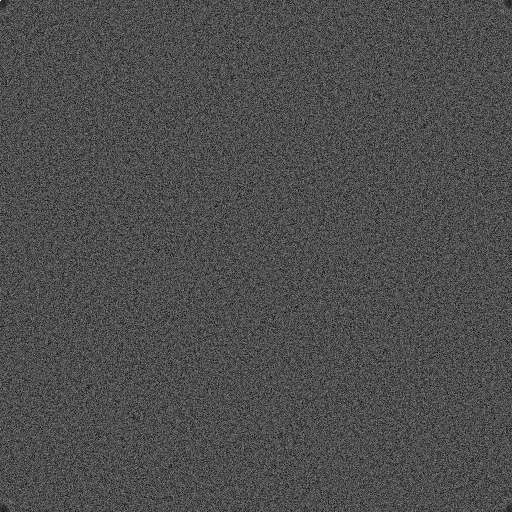
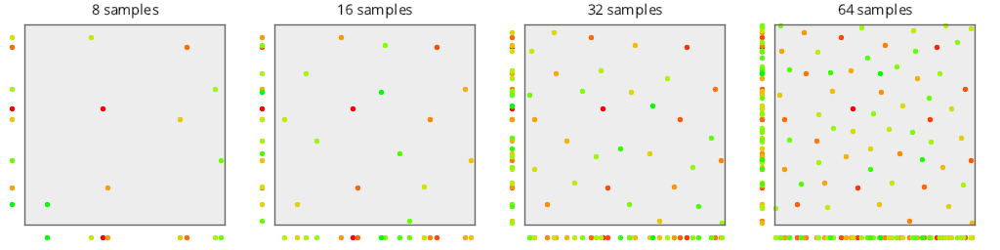
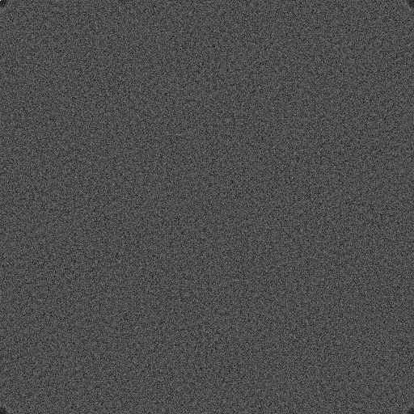
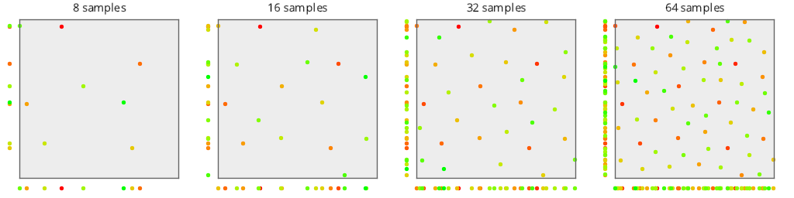
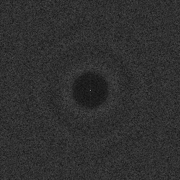
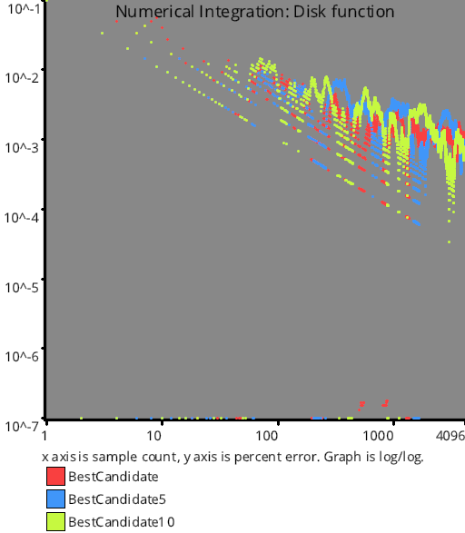
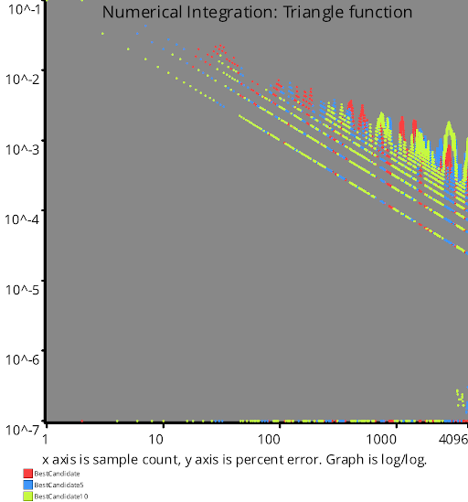
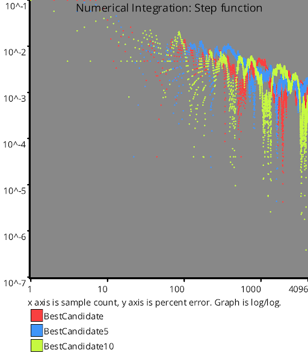
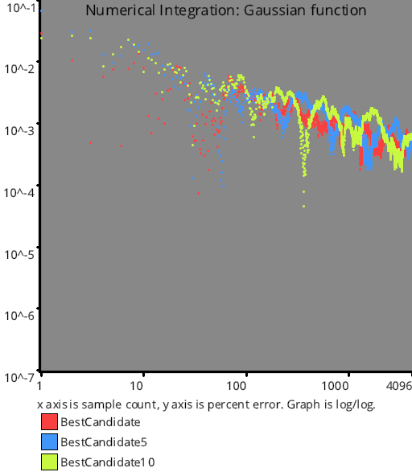
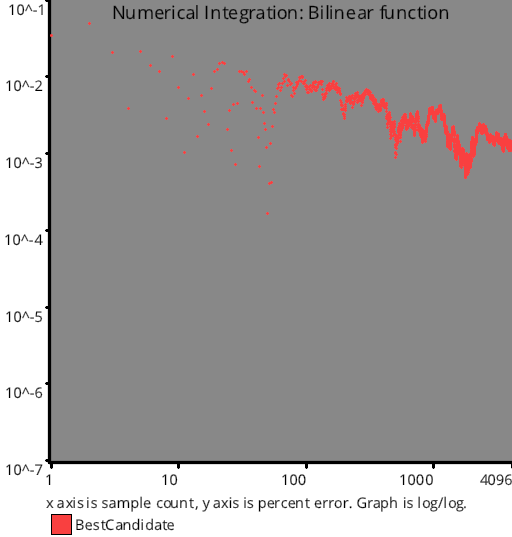

# Blue Noise Sequences
Source Code: [src/families/_2d/samples/blue_noise/](../../../../src/families/_2d/samples/blue_noise/)

# Test Results
 samples tested:
* BestCandidate (Progressive, Randomized)
* BestCandidate5 (Progressive, Randomized)
* BestCandidate10 (Progressive, Randomized)
## BestCandidate
### Discrete Fourier Transform
  
### Plot
  
## BestCandidate5
### Discrete Fourier Transform
  
### Plot
  
## BestCandidate10
### Discrete Fourier Transform
  
### Plot
  
## Numerical Integration
### Disk
  
### Triangle
  
### Step
  
### Gaussian
  
### Bilinear
  
