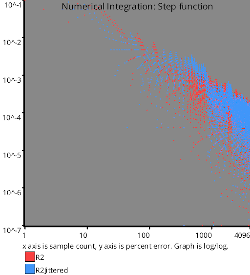

# Irrational Number Sampling
Source Code: [src/families/_2d/samples/irrational_numbers/](../../../../src/families/_2d/samples/irrational_numbers/)

This extends the concept of irrational numbers from 1d to 2d

[1D Irrational Number Sequences](../../../2d/output/_1d/samples/irrational_numbers/page.md)  

There are currently only two 2d irrational number sequence implementations:
* R2
* R2 Jittered

## R2

This sequence was discovered and written about by Martin Roberts (https://twitter.com/TechSparx) at http://extremelearning.com.au/unreasonable-effectiveness-of-quasirandom-sequences/

R2 works by generalizing the golden ratio.

Normally where the golden ratio is the positive solution to the equation x^2=x+1, R2 is based on the real (non imaginary) solution to the equation x^3=x+1.

This number is also called "the plastic constant" and is approximately 1.32471795724474602596.

Let's call that number "g".

To calculate N 2d sampling points, you loop from 0 to N-1 and calculate it like this:
* x = (index / g) % 1
* y = (index / (g * g)) % 1

When indexing starting at zero, the first sample will be (0,0) which we've seen hasn't worked out very well for other sequences, so you can add (0.5, 0.5) to this to make it start in the center and have better properties.

That means you modify the calculations to be this:
* x = (0.5 + index / g) % 1
* y = (0.5 + index / (g * g)) % 1

## R2 Jittered

Knowing that jittering sampling locations can give sampling sequences more blue noise type properties (such as less aliasing), Martin added some jittering to his R2 sequence with good success.  He wrote up the details at http://extremelearning.com.au/a-simple-method-to-construct-isotropic-quasirandom-blue-noise-point-sequences/.

## Links

https://en.wikipedia.org/wiki/Plastic_number - The Plastic Constant
# Test Results
 samples tested:
* R2 (Progressive, Deterministic)
* R2Jittered (Progressive, Randomized)
## R2
### Discrete Fourier Transform
  
### Plot
  
## R2Jittered
### Discrete Fourier Transform
  
### Plot
  
## Discrepancy Test
  
## Numerical Integration
### Disk
  
### Triangle
  
### Step
  
### Gaussian
  
### Bilinear
  
