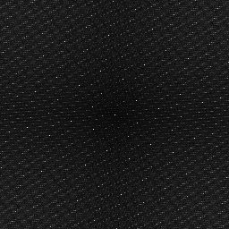
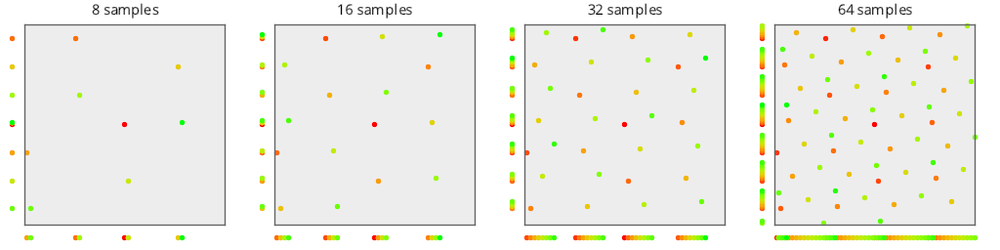

# Test Results
 samples tested:
* R2 (Progressive, Not Randomized)
* R2Jittered (Progressive, Randomized)
## R2
### Discrete Fourier Transform
  
### Plot
  
## R2Jittered
### Discrete Fourier Transform
  
### Plot
  
## Numerical Integration
### Disk
  
### Triangle
  
### Step
  
### Gaussian
  
### Bilinear
  
