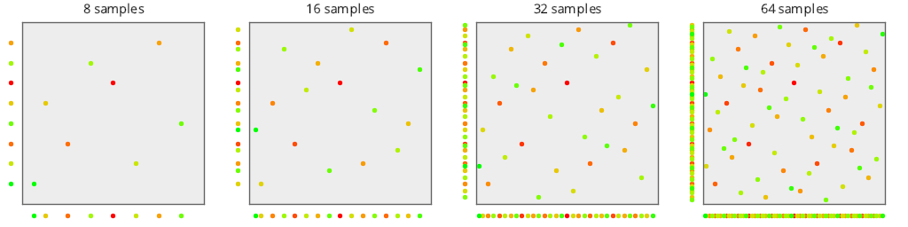

# Low Discrepancy Sequences
Source Code: [src/families/_2d/samples/lds/](../../../../src/families/_2d/samples/lds/)

# Test Results
 samples tested:
* Sobol (Progressive, Not Randomized)
* Halton_2_3_Zero (Progressive, Not Randomized)
* Halton_2_3 (Progressive, Not Randomized)
* Halton_5_7 (Progressive, Not Randomized)
* Halton_13_9 (Progressive, Not Randomized)
## Sobol
### Discrete Fourier Transform
  
### Plot
  
## Halton_2_3_Zero
### Discrete Fourier Transform
  
### Plot
  
## Halton_2_3
### Discrete Fourier Transform
  
### Plot
  
## Halton_5_7
### Discrete Fourier Transform
  
### Plot
  
## Halton_13_9
### Discrete Fourier Transform
  
### Plot
  
