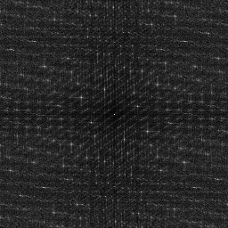
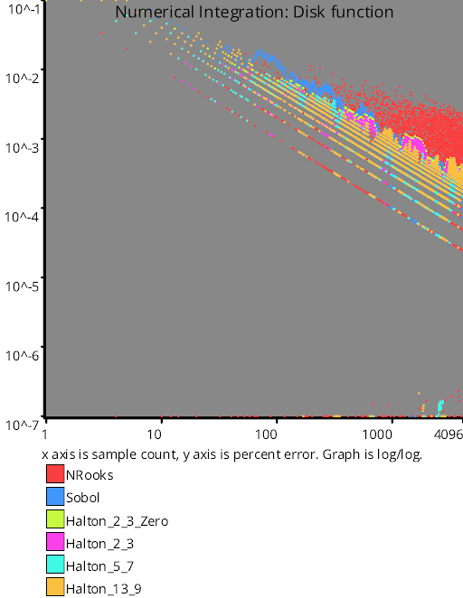
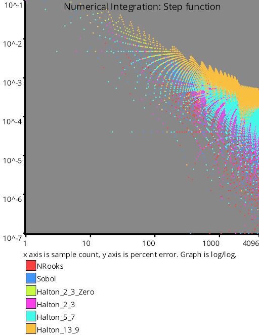

# Low Discrepancy Sequences
Source Code: [src/families/_2d/samples/lds/](../../../../src/families/_2d/samples/lds/)

This extends the concept of low discrepancy numbers from 1d to 2d.

Check out the 1d low discrepancy sequence page for an explanation of the basic ideas:
[1D Low Discrepancy Sequences](../../../2d/output/_1d/samples/lds/page.md)  

## N-Rooks

N-Rooks is a sampling pattern where you treat an NxN image as if it were a chess board.  Every sampling position is a rook that could move horizontally or vertically, and should be placed such that none of these rooks could capture / "see" any of the other rooks.

In other words, every column has a single sample point in it, and every row has a single sample point in it.

An easy way to do this is to start by having a diagonal line of the rooks like (0,0) (1,1) (2,2) ... (N-1, N1), and then randomly shuffling the rows.

While this sampling pattern is randomized pretty heavily using white noise, the 1d projections of this pattern on the X and Y axis have no overlap and are a shuffle, making it better than white noise and also pretty easy to generate.




TODO: finish this page!
# Test Results
 samples tested:
* NRooks (Not Progressive, Randomized)
* Sobol (Progressive, Deterministic)
* Halton_2_3_Zero (Progressive, Deterministic)
* Halton_2_3 (Progressive, Deterministic)
* Halton_5_7 (Progressive, Deterministic)
* Halton_13_9 (Progressive, Deterministic)
## NRooks
### Discrete Fourier Transform
  
### Plot
  
## Sobol
### Discrete Fourier Transform
  
### Plot
  
## Halton_2_3_Zero
### Discrete Fourier Transform
  
### Plot
  
## Halton_2_3
### Discrete Fourier Transform
  
### Plot
  
## Halton_5_7
### Discrete Fourier Transform
  
### Plot
  
## Halton_13_9
### Discrete Fourier Transform
  
### Plot
  
## Discrepancy Test
  
## Numerical Integration
### Disk
  
### Triangle
  
### Step
  
### Gaussian
  
### Bilinear
  
