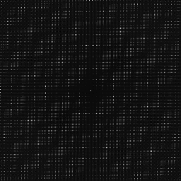
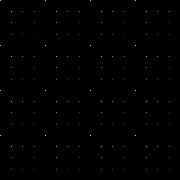
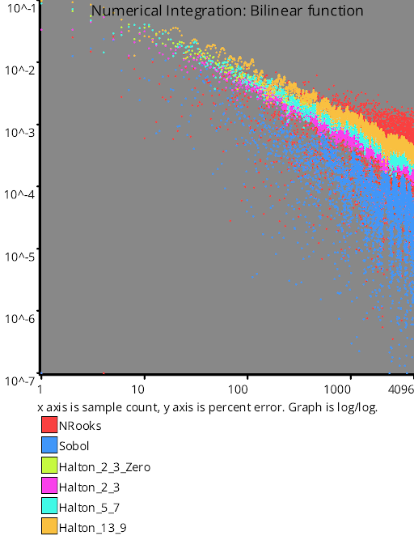

# Low Discrepancy Sequences
Source Code: [src/families/_2d/samples/lds/](../../../../src/families/_2d/samples/lds/)

This extends the concept of low discrepancy numbers from 1d to 2d.

Check out the 1d low discrepancy sequence page for an explanation of the basic ideas:
[1D Low Discrepancy Sequences](../../../2d/output/_1d/samples/lds/page.md)  

## N-Rooks

N-Rooks is a sampling pattern where you treat an NxN image as if it were a chess board.  Every sampling position is a rook that could move horizontally or vertically, and should be placed such that none of these rooks could capture / "see" any of the other rooks.

In other words, every column has a single sample point in it, and every row has a single sample point in it.

An easy way to do this is to start by having a diagonal line of the rooks like (0,0) (1,1) (2,2) ... (N-1, N1), and then randomly shuffling the rows.

While this sampling pattern is randomized pretty heavily using white noise, the 1d projections of this pattern on the X and Y axis have no overlap and are a shuffle, making it better than white noise and also pretty easy to generate.

## Hammersley

The Hammersley sequence is just the 1d Van Der Corput sequence on one axis, and regular sampling on the other axis.  In higher dimensions, you do Van Der Corput on each axis except one, and do regular sampling on that last axis.

Not all choices for base for the VDC axis are good though as you'll see in the test results.  2 and 3 are decent, but 5 is very obviously not a great choice.

Wikipedia describes it exactly like this (https://en.wikipedia.org/wiki/Low-discrepancy_sequence#Hammersley_set) while wolfram math world describes it differently (http://mathworld.wolfram.com/HammersleyPointSet.html).

Wolfram math world says that the last axis isn't index / N, but instead, you reverse the bits and treat them like fractions.  It turns out that these are actually exactly equivalent (same values, same order) so long as you are using base 2, and that you have a power of 2 number of samples.

### Truncating Bits

Beyond the above, you can also modify Hammersley sequences by "truncating bits" (bits in base 2, trits in base 3, etc) from the least significant side of the numbers.

As an example of this, doing 64 samples of base 2 hammersley (6 bits), the first couple samples would be...

x0 = 000000 = 0
y0 = 000000 = 0

x1 = 000001 = 1/2
y1 = 100000 = 1/64

x2 = 000010 = 1/4
x2 = 010000 = 1/32

x3 = 000011 = 3/4
x3 = 110000 = 3/64

x4 = 000100 = 1/8
x4 = 001000 = 1/16

...

If you were to truncate 1 bit from each axis you'd get this:

x0 = 00000 = 0
y0 = 00000 = 0

x1 = 00001 = 1/2
y1 = 00000 = 0

x2 = 00010 = 1/4
x2 = 10000 = 1/32

x3 = 00011 = 3/4
x3 = 10000 = 1/32

x4 = 00100 = 1/8
x4 = 01000 = 1/16

...

Truncating 2 bits would give you this:

x0 = 0000 = 0
y0 = 0000 = 0

x1 = 0001 = 1/2
y1 = 0000 = 0

x2 = 0010 = 1/4
x2 = 0000 = 0

x3 = 0011 = 3/4
x3 = 0000 = 0

x4 = 0100 = 1/8
x4 = 1000 = 1/16

...

And truncating 3 bits would give you this, which since it leaves 3 unique bits per each axis ends up becoming a regular grid of 8x8 samples.

x0 = 000 = 0
y0 = 000 = 0

x1 = 001 = 1/2
y1 = 000 = 0

x2 = 010 = 1/4
x2 = 000 = 0

x3 = 011 = 3/4
x3 = 000 = 0

x4 = 100 = 1/8
x4 = 000 = 0

...

Going beyond 3 bits gives a regular grid as well, but with fewer unique points. Truncating 4 bits gives you a 4x4 grid. Truncating 5 bits gives you a 2x2 grid. Truncating 6 bits gives you a single point where all the samples lie, at (0,0).

### The Usual Regular Sampling Situation

Hammersley is Van Der Corput sequences on all axes except one (which you could also say it's Halton on all axes except one, which means the same thing), but that one axis is just regular sampling.

All the common descriptions of Hammersley I could find left it at that, but if you think back to the 1d regular sampling, you'll remember that index/N is not really great for regular sampling.

If you need a refresher on that: [1D Regular Sampling](../../../2d/output/_1d/samples/regular/page.md)  

TODO: move this up. Make manual test images to show things.
# Test Results
 samples tested:
* NRooks (Not Progressive, Randomized)
* Hammersley2NoOffset (Not Progressive, Deterministic)
* Hammersley2 (Not Progressive, Deterministic)
* Hammersley3 (Not Progressive, Deterministic)
* Hammersley5 (Not Progressive, Deterministic)
* Hammersley2_1Bit (Not Progressive, Deterministic)
* Hammersley2_2Bit (Not Progressive, Deterministic)
* Hammersley2_3Bit (Not Progressive, Deterministic)
* Hammersley2_4Bit (Not Progressive, Deterministic)
* Sobol (Progressive, Deterministic)
* Halton_2_3_Zero (Progressive, Deterministic)
* Halton_2_3 (Progressive, Deterministic)
* Halton_5_7 (Progressive, Deterministic)
* Halton_13_9 (Progressive, Deterministic)
## NRooks
### Discrete Fourier Transform
  
### Plot
  
## Hammersley2NoOffset
### Discrete Fourier Transform
  
### Plot
  
## Hammersley2
### Discrete Fourier Transform
  
### Plot
  
## Hammersley3
### Discrete Fourier Transform
  
### Plot
  
## Hammersley5
### Discrete Fourier Transform
  
### Plot
  
## Hammersley2_1Bit
### Discrete Fourier Transform
  
### Plot
  
## Hammersley2_2Bit
### Discrete Fourier Transform
  
### Plot
  
## Hammersley2_3Bit
### Discrete Fourier Transform
  
### Plot
  
## Hammersley2_4Bit
### Discrete Fourier Transform
  
### Plot
  
## Sobol
### Discrete Fourier Transform
  
### Plot
  
## Halton_2_3_Zero
### Discrete Fourier Transform
  
### Plot
  
## Halton_2_3
### Discrete Fourier Transform
  
### Plot
  
## Halton_5_7
### Discrete Fourier Transform
  
### Plot
  
## Halton_13_9
### Discrete Fourier Transform
  
### Plot
  
## Discrepancy Test
  
## Numerical Integration
### Disk
  
### Triangle
  
### Step
  
### Gaussian
  
### Bilinear
  
