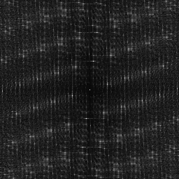
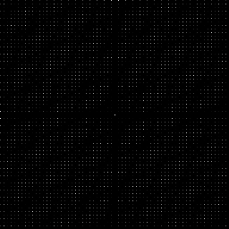
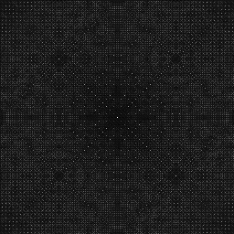

# Test Results
 samples tested:
* NRooks (Not Progressive, Randomized)
* Hammersley2NoOffset (Not Progressive, Deterministic)
* Hammersley2 (Not Progressive, Deterministic)
* Hammersley3 (Not Progressive, Deterministic)
* Hammersley5 (Not Progressive, Deterministic)
* Hammersley2_1Bit (Not Progressive, Deterministic)
* Hammersley2_2Bit (Not Progressive, Deterministic)
* Hammersley2_3Bit (Not Progressive, Deterministic)
* Hammersley2_4Bit (Not Progressive, Deterministic)
* Sobol (Progressive, Deterministic)
* Halton_2_3_Zero (Progressive, Deterministic)
* Halton_2_3 (Progressive, Deterministic)
* Halton_5_7 (Progressive, Deterministic)
* Halton_13_9 (Progressive, Deterministic)
## NRooks
### Discrete Fourier Transform
  
### Plot
  
## Hammersley2NoOffset
### Discrete Fourier Transform
  
### Plot
  
## Hammersley2
### Discrete Fourier Transform
  
### Plot
  
## Hammersley3
### Discrete Fourier Transform
  
### Plot
  
## Hammersley5
### Discrete Fourier Transform
  
### Plot
  
## Hammersley2_1Bit
### Discrete Fourier Transform
  
### Plot
  
## Hammersley2_2Bit
### Discrete Fourier Transform
  
### Plot
  
## Hammersley2_3Bit
### Discrete Fourier Transform
  
### Plot
  
## Hammersley2_4Bit
### Discrete Fourier Transform
  
### Plot
  
## Sobol
### Discrete Fourier Transform
  
### Plot
  
## Halton_2_3_Zero
### Discrete Fourier Transform
  
### Plot
  
## Halton_2_3
### Discrete Fourier Transform
  
### Plot
  
## Halton_5_7
### Discrete Fourier Transform
  
### Plot
  
## Halton_13_9
### Discrete Fourier Transform
  
### Plot
  
## Discrepancy Test
  
## Numerical Integration
### Disk
  
### Triangle
  
### Step
  
### Gaussian
  
### Bilinear
  
