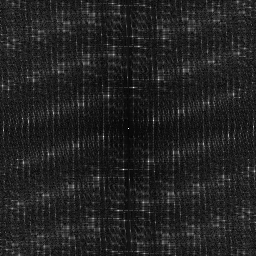
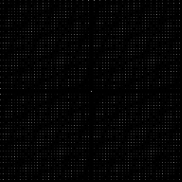
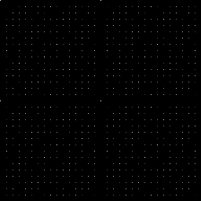
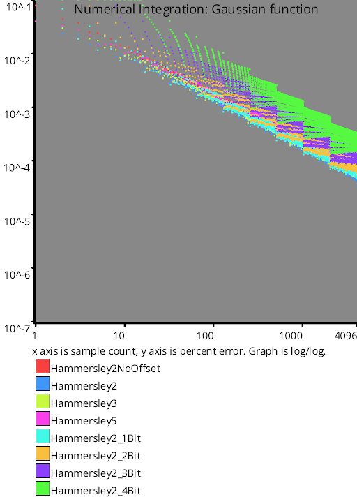

# Hammersley Low Discrepancy Sequence
Source Code: [src/families/_2d/samples/lds_hammersley/](../../../../src/families/_2d/samples/lds_hammersley/)

This extends the concept of low discrepancy numbers from 1d to 2d.

Check out the 1d low discrepancy sequence page for an explanation of the basic ideas:
[1D Low Discrepancy Sequences](../../../2d/output/_1d/samples/lds/page.md)  

The Hammersley sequence in 2D is just the 1d Van Der Corput sequence on one axis, and regular sampling on the other axis.

In higher dimensions, you do Van Der Corput on each axis except one, and do regular sampling on that last axis.  Another way of saying that is that it's Halton on all except the last axis, and regular on the last axis.  Those two ways of explaining it are exactly the same.

Not all choices for base for the VDC axis are good though as you'll see in the test results.  2 and 3 are decent, but 5 is very obviously not a great choice.

Wikipedia describes it exactly like this (https://en.wikipedia.org/wiki/Low-discrepancy_sequence#Hammersley_set) while wolfram math world describes it differently (http://mathworld.wolfram.com/HammersleyPointSet.html).

Wolfram math world says that the last axis isn't index / N, but instead, you reverse the bits and treat them like fractions.  It turns out that these are actually exactly equivalent (same values, same order) so long as you are using base 2, and that you have a power of 2 number of samples.  (more generaly, when using base N and a power of N number of samples, you reverse the N-its and treat them like fractions)

## Truncating Bits

Beyond the above, you can also modify Hammersley sequences by "truncating bits" (bits in base 2, trits in base 3, etc) from the least significant side of the numbers.

As an example of this, doing 64 samples of base 2 hammersley (6 bits), the first couple samples would be...

x0 = 000000 = 0
y0 = 000000 = 0

x1 = 000001 = 1/2
y1 = 100000 = 1/64

x2 = 000010 = 1/4
x2 = 010000 = 1/32

x3 = 000011 = 3/4
x3 = 110000 = 3/64

x4 = 000100 = 1/8
x4 = 001000 = 1/16

...

If you were to truncate 1 bit from each axis you'd get this:

x0 = 00000 = 0
y0 = 00000 = 0

x1 = 00001 = 1/2
y1 = 00000 = 0

x2 = 00010 = 1/4
x2 = 10000 = 1/32

x3 = 00011 = 3/4
x3 = 10000 = 1/32

x4 = 00100 = 1/8
x4 = 01000 = 1/16

...

Truncating 2 bits would give you this:

x0 = 0000 = 0
y0 = 0000 = 0

x1 = 0001 = 1/2
y1 = 0000 = 0

x2 = 0010 = 1/4
x2 = 0000 = 0

x3 = 0011 = 3/4
x3 = 0000 = 0

x4 = 0100 = 1/8
x4 = 1000 = 1/16

...

And truncating 3 bits would give you this, which since it leaves 3 unique bits per each axis ends up becoming a regular grid of 8x8 samples.

x0 = 000 = 0
y0 = 000 = 0

x1 = 001 = 1/2
y1 = 000 = 0

x2 = 010 = 1/4
x2 = 000 = 0

x3 = 011 = 3/4
x3 = 000 = 0

x4 = 100 = 1/8
x4 = 000 = 0

...

Going beyond 3 bits gives a regular grid as well, but with fewer unique points. Truncating 4 bits gives you a 4x4 grid. Truncating 5 bits gives you a 2x2 grid. Truncating 6 bits gives you a single point where all the samples lie, at (0,0).

## The Usual Regular Sampling Situation

Hammersley is Van Der Corput sequences on all axes except one (which you could also say it's Halton on all axes except one, which means the same thing), but that one axis is just regular sampling.

All the common descriptions of Hammersley I could find left it at that, but if you think back to the 1d regular sampling, you'll remember that index/N is not really great for regular sampling.

If you need a refresher on that: [1D Regular Sampling](../../../2d/output/_1d/samples/regular/page.md)  

TODO: move this up. Make manual test images to show things.
# Test Results
 samples tested:
* Hammersley2NoOffset (Not Progressive, Deterministic)
* Hammersley2 (Not Progressive, Deterministic)
* Hammersley3 (Not Progressive, Deterministic)
* Hammersley5 (Not Progressive, Deterministic)
* Hammersley2_1Bit (Not Progressive, Deterministic)
* Hammersley2_2Bit (Not Progressive, Deterministic)
* Hammersley2_3Bit (Not Progressive, Deterministic)
* Hammersley2_4Bit (Not Progressive, Deterministic)
## Hammersley2NoOffset
### Discrete Fourier Transform
  
### Plot
  
## Hammersley2
### Discrete Fourier Transform
  
### Plot
  
## Hammersley3
### Discrete Fourier Transform
  
### Plot
  
## Hammersley5
### Discrete Fourier Transform
  
### Plot
  
## Hammersley2_1Bit
### Discrete Fourier Transform
  
### Plot
  
## Hammersley2_2Bit
### Discrete Fourier Transform
  
### Plot
  
## Hammersley2_3Bit
### Discrete Fourier Transform
  
### Plot
  
## Hammersley2_4Bit
### Discrete Fourier Transform
  
### Plot
  
## Discrepancy Test
  
## Numerical Integration
### Disk
  
### Triangle
  
### Step
  
### Gaussian
  
### Bilinear
  
