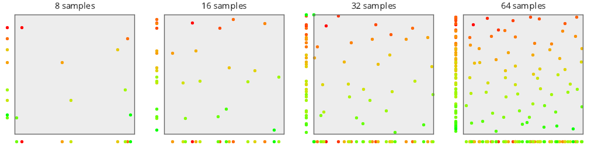
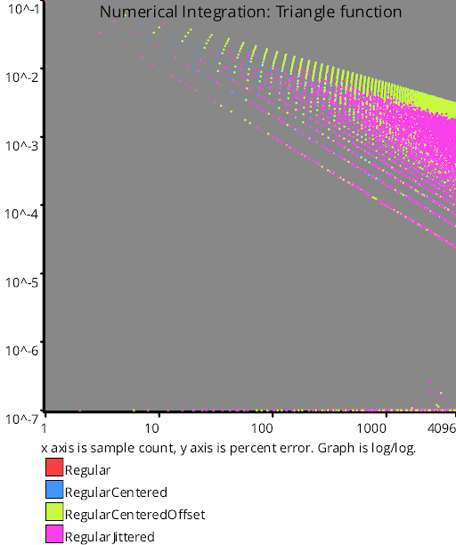
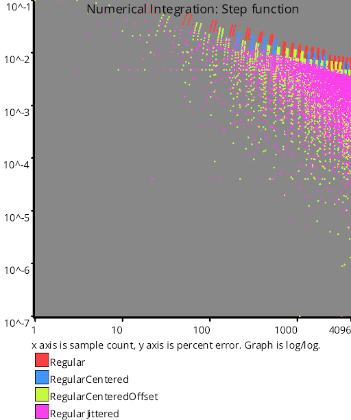
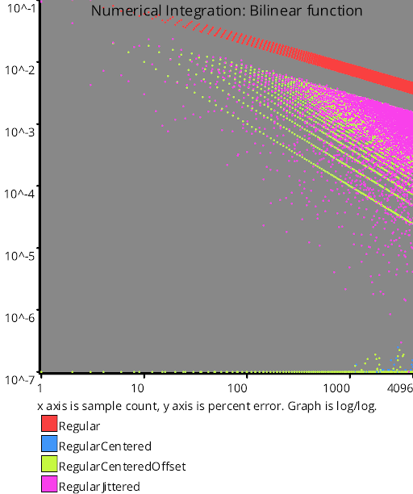

# Regular Sampling
Source Code: [src/families/_2d/samples/regular/](../../../../src/families/_2d/samples/regular/)

The 2d regular sampling sequences are direct extensions of the 1d regular sampling sequences.

[1D Regular Sampling](../../../2d/output/_1d/samples/regular/page.md)  

It might be odd to see that RegularJittered has the lowest discrepancy of these sequences, but discrepancy gets a bit more complex in 2d.  Basically, those big empty rows and columns between samples in regular sampling contribute to making larger discrepancy for those sequences.  Adding random jitter causes those regions to get broken up.
# Test Results
 samples tested:
* Regular (Not Progressive, Deterministic)
* RegularCentered (Not Progressive, Deterministic)
* RegularCenteredOffset (Not Progressive, Deterministic)
* RegularJittered (Not Progressive, Randomized)
## Regular
### Discrete Fourier Transform
  
### Plot
  
## RegularCentered
### Discrete Fourier Transform
  
### Plot
  
## RegularCenteredOffset
### Discrete Fourier Transform
  
### Plot
  
## RegularJittered
### Discrete Fourier Transform
  
### Plot
  
## Discrepancy Test
  
## Numerical Integration
### Disk
  
### Triangle
  
### Step
  
### Gaussian
  
### Bilinear
  
