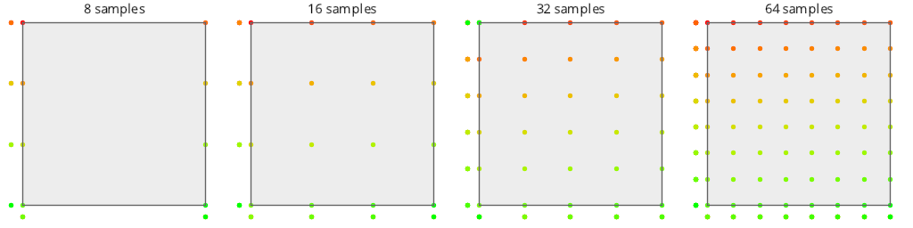

# Test Results
 samples tested:
* Regular (Not Progressive, Not Randomized)
* RegularCentered (Not Progressive, Not Randomized)
* RegularCenteredOffset (Not Progressive, Not Randomized)
* RegularJittered (Not Progressive, Randomized)
## Regular
### Discrete Fourier Transform
  
### Plot
  
## RegularCentered
### Discrete Fourier Transform
  
### Plot
  
## RegularCenteredOffset
### Discrete Fourier Transform
  
### Plot
  
## RegularJittered
### Discrete Fourier Transform
  
### Plot
  
