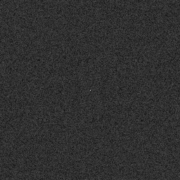
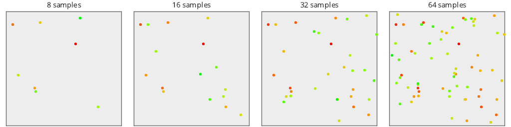
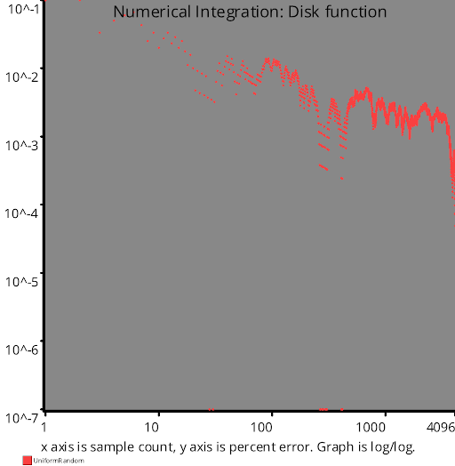
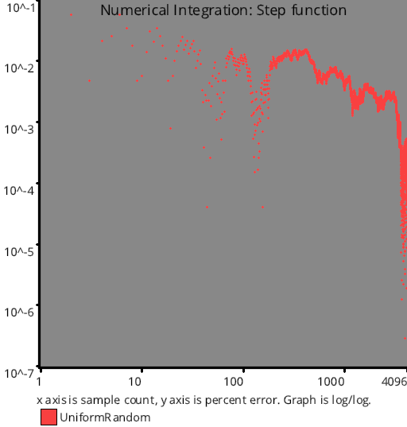
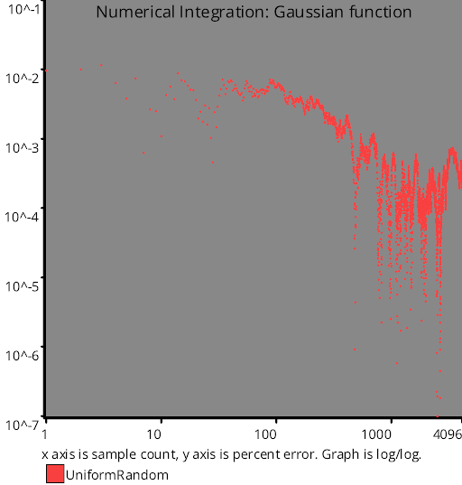

# Uniform Random Number Sampling
Source Code: [src/families/_2d/samples/uniform_random/](../../../../src/families/_2d/samples/uniform_random/)

# Test Results
 samples tested:
* UniformRandom (Progressive, Randomized)
## UniformRandom
### Discrete Fourier Transform
  
### Plot
  
## Numerical Integration
### Disk
  
### Triangle
  
### Step
  
### Gaussian
  
### Bilinear
  
