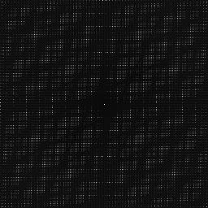
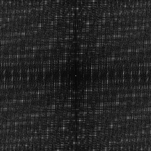
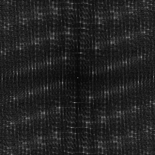
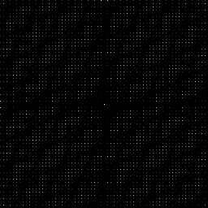
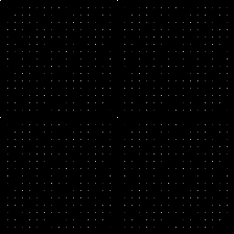
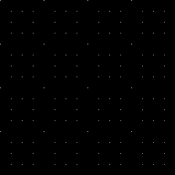

# Discrete Fourier Transform
Source Code: [/src/families/_2d/tests/dft/](../../../../src/families/_2d/tests/dft/)

This is the same as the 1d DFT test, but in 2d.  The center of the image is 0hz.

[1D DFT Test](../../../_1d/tests/dft/page.md)  

Nothing special is done for randomized vs deterministic sequences, or progressive vs non progressive sequences.
# Test Results
 tests done:
* DFT
## DFT
### Blue Noise Sequences
#### BestCandidate (Progressive, Randomized)
  
#### BestCandidate5 (Progressive, Randomized)
  
#### BestCandidate10 (Progressive, Randomized)
  
### Irrational Number Sampling
#### R2 (Progressive, Deterministic)
  
#### R2Jittered (Progressive, Randomized)
  
### Low Discrepancy Sequences
#### NRooks (Not Progressive, Randomized)
  
#### Hammersley2NoOffset (Not Progressive, Deterministic)
  
#### Hammersley2 (Not Progressive, Deterministic)
  
#### Hammersley3 (Not Progressive, Deterministic)
  
#### Hammersley5 (Not Progressive, Deterministic)
  
#### Hammersley2_1Bit (Not Progressive, Deterministic)
  
#### Hammersley2_2Bit (Not Progressive, Deterministic)
  
#### Hammersley2_3Bit (Not Progressive, Deterministic)
  
#### Hammersley2_4Bit (Not Progressive, Deterministic)
  
#### Sobol (Progressive, Deterministic)
  
#### Halton_2_3_Zero (Progressive, Deterministic)
  
#### Halton_2_3 (Progressive, Deterministic)
  
#### Halton_5_7 (Progressive, Deterministic)
  
#### Halton_13_9 (Progressive, Deterministic)
  
### Regular Sampling
#### Regular (Not Progressive, Deterministic)
  
#### RegularCentered (Not Progressive, Deterministic)
  
#### RegularCenteredOffset (Not Progressive, Deterministic)
  
#### RegularJittered (Not Progressive, Randomized)
  
### Uniform Random Number Sampling
#### UniformRandom (Progressive, Randomized)
  
