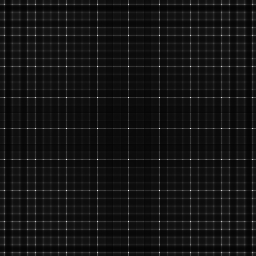

# Discrete Fourier Transform
Source Code: [/src/families/_2d/tests/dft/](../../../../src/families/_2d/tests/dft/)

# Test Results
 tests done:
* DFT
## DFT
### Blue Noise Sequences
#### BestCandidate
  
#### BestCandidate5
  
#### BestCandidate10
  
### Low Discrepancy Sequences
#### NRooks
  
#### Hammersley
  
#### Hammersley_1Bit
  
#### Hammersley_2Bits
  
#### Sobol
  
#### Halton_2_3_Zero
  
#### Halton_2_3
  
#### Halton_5_7
  
#### Halton_13_9
  
### Regular Sampling
#### Regular
  
#### RegularCentered
  
#### RegularCenteredOffset
  
#### RegularJittered
  
### Uniform Random Number Sampling
#### UniformRandom
  
