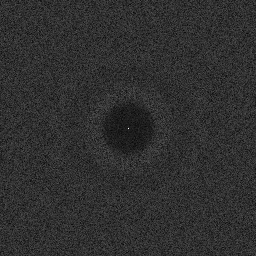
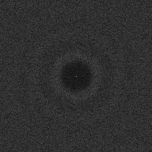
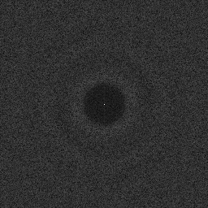

# Discrete Fourier Transform
Source Code: [/src/families/_2d/tests/dft/](../../../../src/families/_2d/tests/dft/)

# Test Results
 tests done:
* DFT
## DFT
### Blue Noise Sequences
#### BestCandidate
  
#### BestCandidate5
  
#### BestCandidate10
  
### Uniform Random Number Sampling
#### UniformRandom
  
