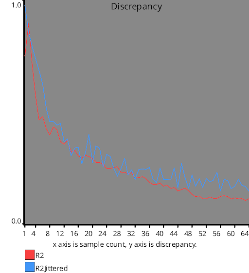
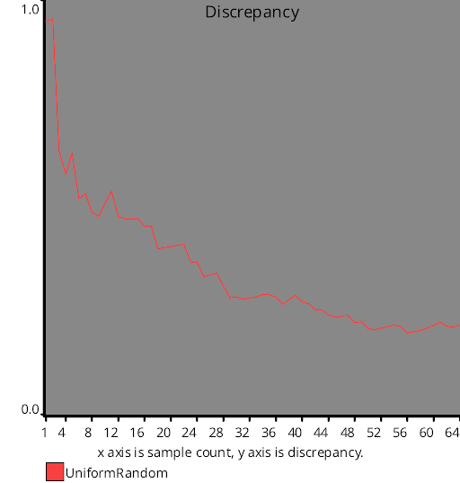

# Discrepancy Test
Source Code: [/src/families/_2d/tests/discrepancy/](../../../../src/families/_2d/tests/discrepancy/)

# Test Results
 tests done:
* CalculateDiscrepancy
## CalculateDiscrepancy
### Blue Noise Sequences
  
### Irrational Number Sampling
  
### Low Discrepancy Sequences
  
### Regular Sampling
  
### Uniform Random Number Sampling
  
