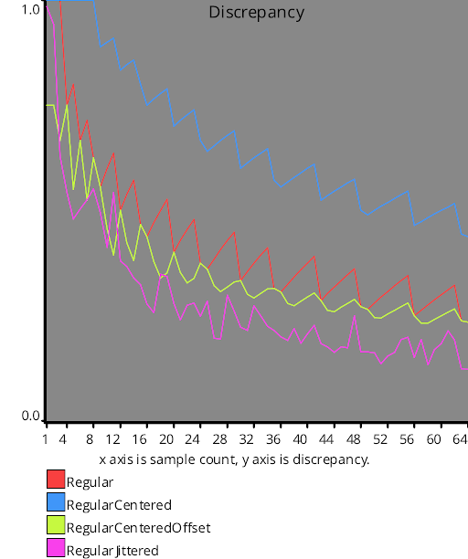

# Discrepancy Test
Source Code: [/src/families/_2d/tests/discrepancy/](../../../../src/families/_2d/tests/discrepancy/)

This is the same as the 1d discrepancy test, but in 2d.

[1D Discrepancy Test](../../../_1d/tests/discrepancy/page.md)  

Calculating discrepancy gets a lot more expensive each dimension you go up.

In 1d, it's an O(n^2) operation, but in 2d, it's an O(n^4) operation.

Intuition about discrepancy changes as you go up in dimension as well.  What had low discrepancy in 1d may not have low discrepancy in 2d and higher.  For instance, in 1d, regular sampling had the lowest discrepancy, but in 2d (and up), that isn't the case due to those long rows and columns of empty space between the sampling points.

Blue noise has lower discrepancy than regular sampling in 2d, as does regular jittered sampling. Neither of those things are true in 1d.

This difference in discrepancy also affects how well the sequences perform for integration.

# Test Results
 tests done:
* CalculateDiscrepancy
## CalculateDiscrepancy
### Blue Noise Sequences
  
### Irrational Number Sampling
  
### Low Discrepancy Sequences
  
### Regular Sampling
  
### Uniform Random Number Sampling
  
