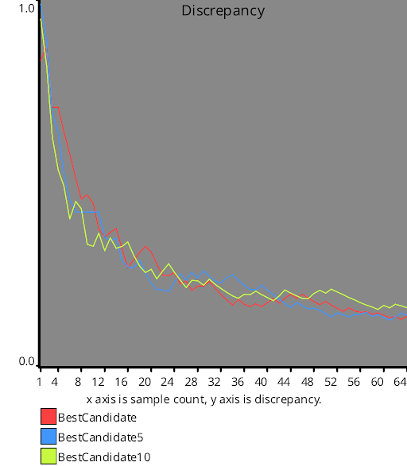
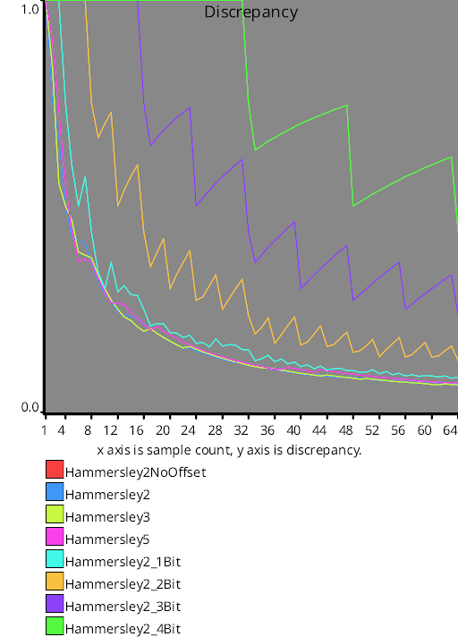
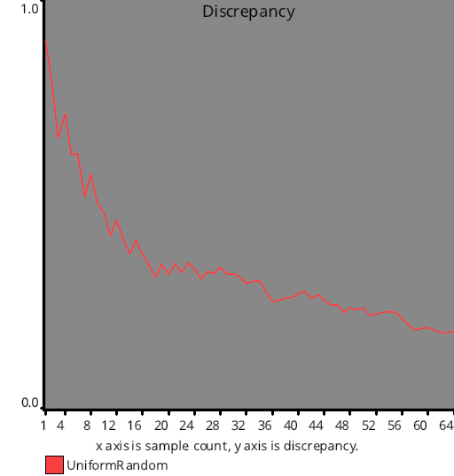

# Test Results
 tests done:
* CalculateDiscrepancy
## CalculateDiscrepancy
### Blue Noise Sequences
  
### Irrational Number Sampling
  
### Low Discrepancy Sequences
  
### Hammersley Low Discrepancy Sequence
  
### Regular Sampling
  
### Uniform Random Number Sampling
  
