# Numerical Integration
Source Code: [/src/families/_2d/tests/integration/](../../../../src/families/_2d/tests/integration/)

This is the same as the 1d integration test, but integrating over 2d functions instead of 1d functions.

[1D Integration Test](../../../_1d/tests/integration/page.md)  

The functions being integrated over are:
* Disk: the inside of a circle with radius 2/pi
* Triangle: y > x
* Step: x < 1/pi
* Gaussian: z = e^(-x^2-y^2)
* Bilinear: z = x * y

  
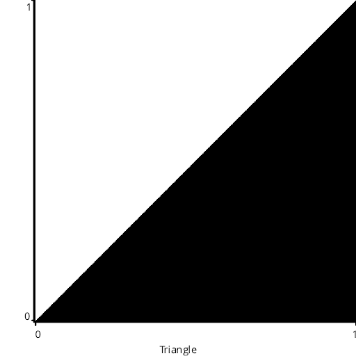  
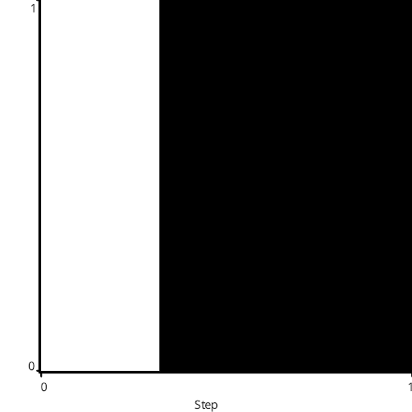  
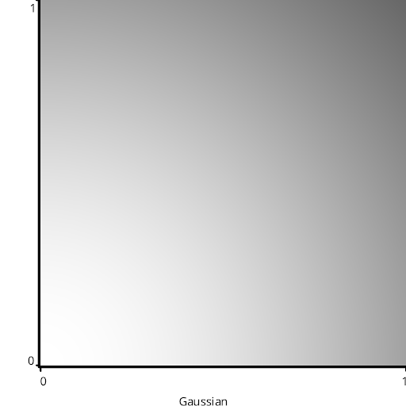  
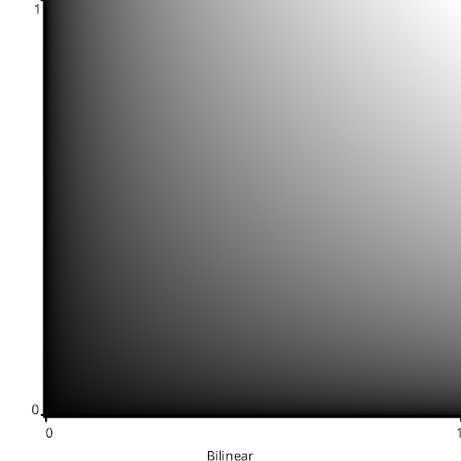  

# Test Results
 tests done:
* Disk
* Triangle
* Step
* Gaussian
* Bilinear
## Disk
### Blue Noise Sequences
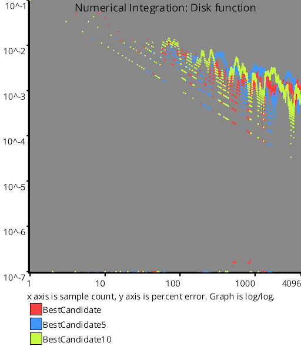  
### Irrational Number Sampling
  
### Low Discrepancy Sequences
  
### Regular Sampling
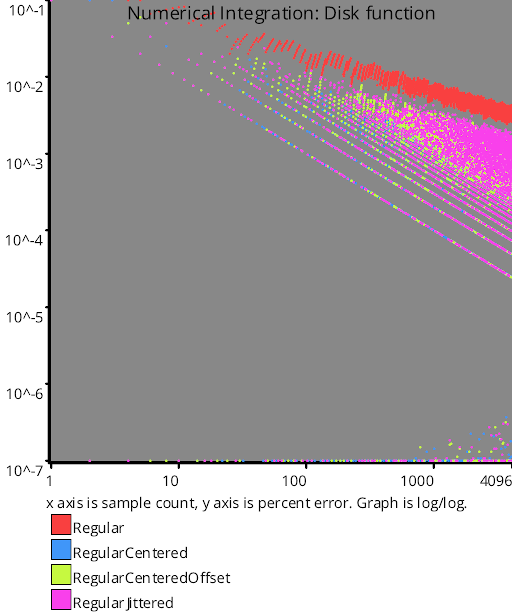  
### Uniform Random Number Sampling
  
## Triangle
### Blue Noise Sequences
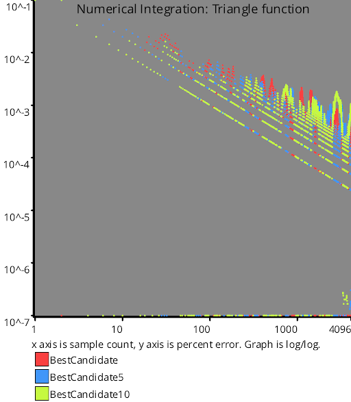  
### Irrational Number Sampling
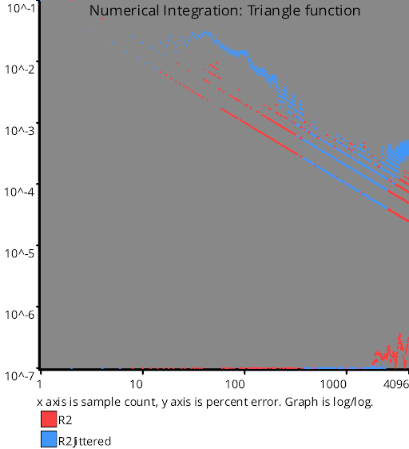  
### Low Discrepancy Sequences
  
### Regular Sampling
  
### Uniform Random Number Sampling
  
## Step
### Blue Noise Sequences
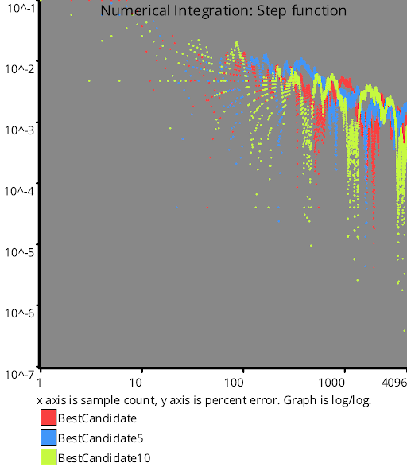  
### Irrational Number Sampling
  
### Low Discrepancy Sequences
  
### Regular Sampling
  
### Uniform Random Number Sampling
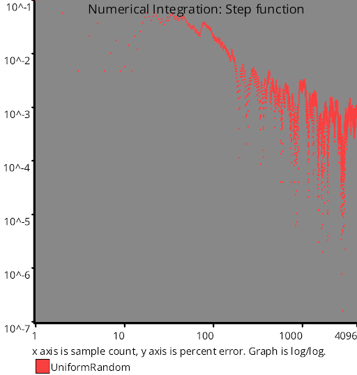  
## Gaussian
### Blue Noise Sequences
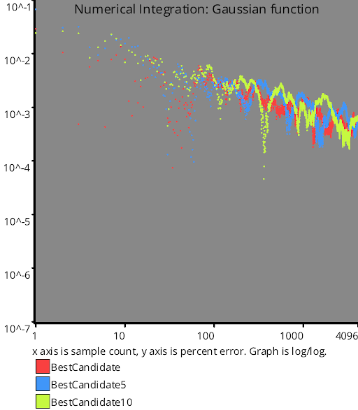  
### Irrational Number Sampling
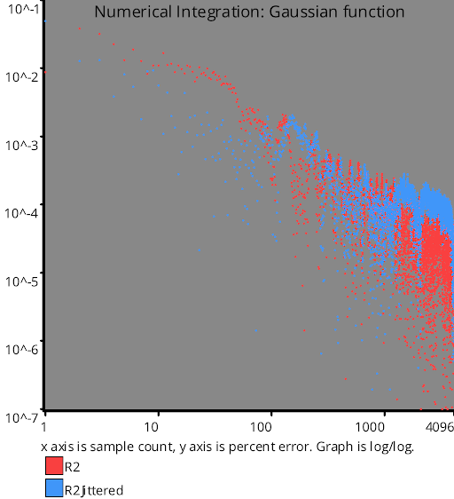  
### Low Discrepancy Sequences
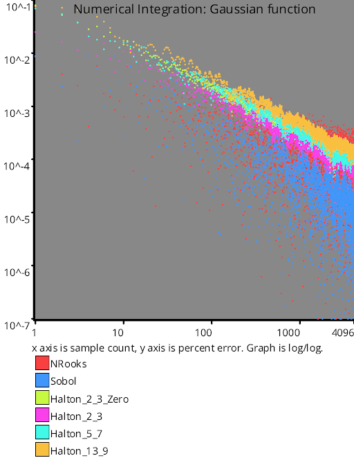  
### Regular Sampling
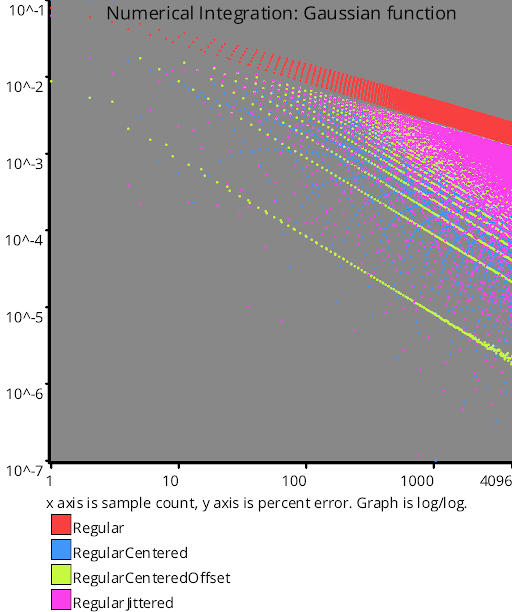  
### Uniform Random Number Sampling
  
## Bilinear
### Blue Noise Sequences
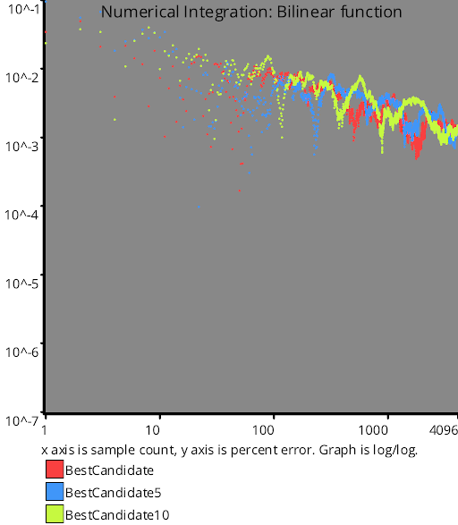  
### Irrational Number Sampling
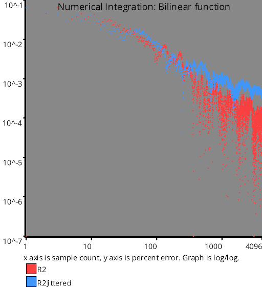  
### Low Discrepancy Sequences
  
### Regular Sampling
  
### Uniform Random Number Sampling
  
