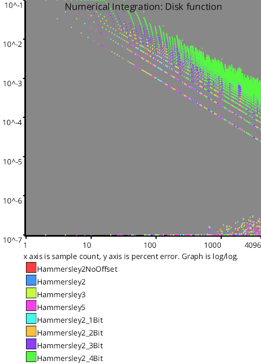
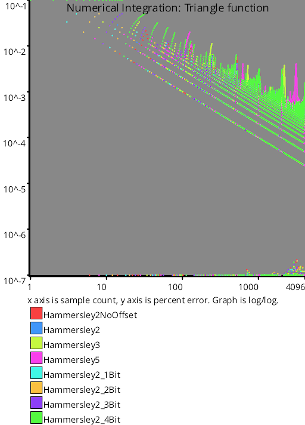
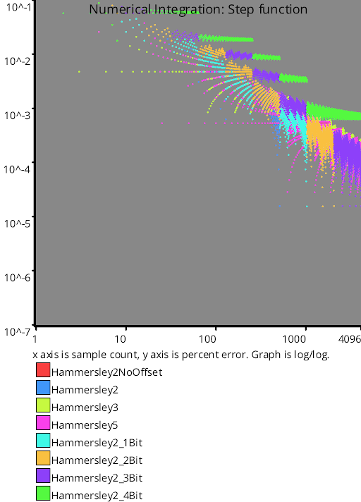
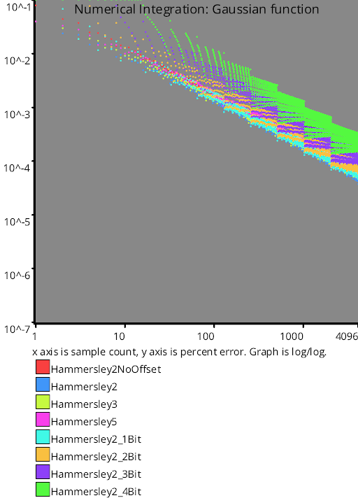
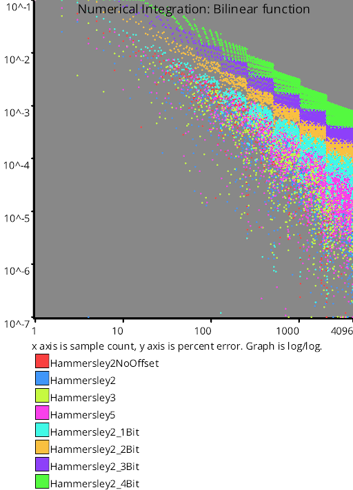

# Test Results
 tests done:
* Disk
* Triangle
* Step
* Gaussian
* Bilinear
## Disk
### Blue Noise Sequences
  
### Irrational Number Sampling
  
### Low Discrepancy Sequences
  
### Hammersley Low Discrepancy Sequence
  
### Regular Sampling
  
### Uniform Random Number Sampling
  
## Triangle
### Blue Noise Sequences
  
### Irrational Number Sampling
  
### Low Discrepancy Sequences
  
### Hammersley Low Discrepancy Sequence
  
### Regular Sampling
  
### Uniform Random Number Sampling
  
## Step
### Blue Noise Sequences
  
### Irrational Number Sampling
  
### Low Discrepancy Sequences
  
### Hammersley Low Discrepancy Sequence
  
### Regular Sampling
  
### Uniform Random Number Sampling
  
## Gaussian
### Blue Noise Sequences
  
### Irrational Number Sampling
  
### Low Discrepancy Sequences
  
### Hammersley Low Discrepancy Sequence
  
### Regular Sampling
  
### Uniform Random Number Sampling
  
## Bilinear
### Blue Noise Sequences
  
### Irrational Number Sampling
  
### Low Discrepancy Sequences
  
### Hammersley Low Discrepancy Sequence
  
### Regular Sampling
  
### Uniform Random Number Sampling
  
