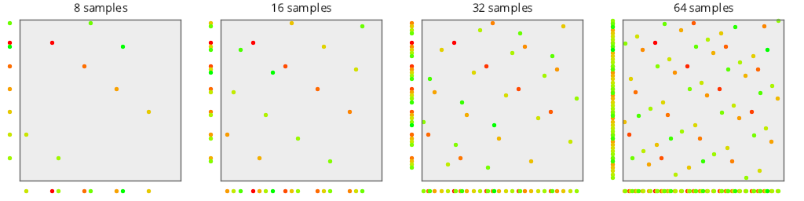
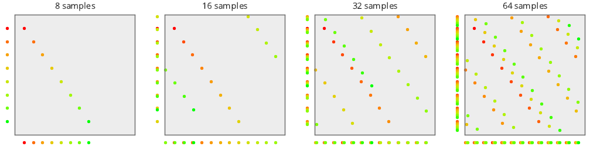

# Plot
Source Code: [/src/families/_2d/tests/plot/](../../../../src/families/_2d/tests/plot/)

Plotting 2d sample points is the 2d equivelant of the 1d numberline tests.

[1D Regular Sampling](../../../_1d/tests/numberline/page.md)  

A difference from 1d however, is that we also project the points to the X and Y axis.

Several modern research papers say and show that sampling sequences that are "still good" (for instance, low discrepancy) when projected to an axis outperform sequences that don't.  This test showing those projections let you see how well the sequences project to those lower subspaces.

For some intuition about why this is true, imagine that you are integrating over a square region of pixels that has a vertical line in it, where everything to the right is black, and everything to the left is white.

When you use a 2d sampling location to sample this region, the y axis doesn't matter. Whatever you change the y axis to, as long as you leave x alone, you'll get the same value.

Because of this, it reduces the sampling / integration problem to 1d, on the x axis specifically.

That means that the quality of the sampling sequence in this situation is going to be based entirely on how good the x axis projection of the sampling sequence can do in 1d.

This might sound far fetched, but imagine trying to integrate some soft shadows for a vertical building.  You are likely going to hit this exact problem.

Thinking about this, you might wonder (like i do) why the x and y axis is so special.  Wouldn't you want something that projects as well as possible on all random axes?  I definitely think so but have not yet seen any research papers talking about this.

## Papers

http://resources.mpi-inf.mpg.de/ProjectiveBlueNoise/ - "Projective Blue-Noise Sampling " from 2015
# Test Results
 tests done:
* MakePlot
## MakePlot
### Blue Noise Sequences
#### BestCandidate (Progressive, Randomized)
  
#### BestCandidate5 (Progressive, Randomized)
  
#### BestCandidate10 (Progressive, Randomized)
  
### Irrational Number Sampling
#### R2 (Progressive, Deterministic)
  
#### R2Jittered (Progressive, Randomized)
  
### Low Discrepancy Sequences
#### NRooks (Not Progressive, Randomized)
  
#### Hammersley2NoOffset (Not Progressive, Deterministic)
  
#### Hammersley2 (Not Progressive, Deterministic)
  
#### Hammersley3 (Not Progressive, Deterministic)
  
#### Hammersley5 (Not Progressive, Deterministic)
  
#### Hammersley2_1Bit (Not Progressive, Deterministic)
  
#### Hammersley2_2Bit (Not Progressive, Deterministic)
  
#### Hammersley2_3Bit (Not Progressive, Deterministic)
  
#### Hammersley2_4Bit (Not Progressive, Deterministic)
  
#### Sobol (Progressive, Deterministic)
  
#### Halton_2_3_Zero (Progressive, Deterministic)
  
#### Halton_2_3 (Progressive, Deterministic)
  
#### Halton_5_7 (Progressive, Deterministic)
  
#### Halton_13_9 (Progressive, Deterministic)
  
### Regular Sampling
#### Regular (Not Progressive, Deterministic)
  
#### RegularCentered (Not Progressive, Deterministic)
  
#### RegularCenteredOffset (Not Progressive, Deterministic)
  
#### RegularJittered (Not Progressive, Randomized)
  
### Uniform Random Number Sampling
#### UniformRandom (Progressive, Randomized)
  
