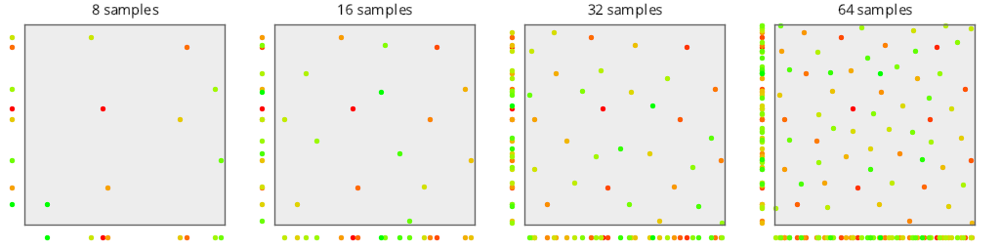

# Plot
Source Code: [/src/families/_2d/tests/plot/](../../../../src/families/_2d/tests/plot/)

# Test Results
 tests done:
* MakePlot
## MakePlot
### Blue Noise Sequences
#### BestCandidate
  
#### BestCandidate5
  
### Uniform Random Number Sampling
#### UniformRandom
  
