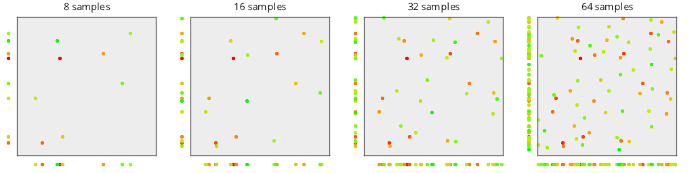
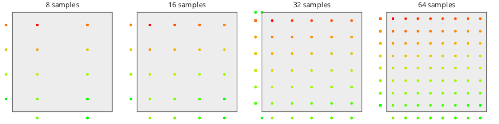

# Test Results
 tests done:
* MakePlot
## MakePlot
### Blue Noise Sequences
#### BestCandidate (Progressive, Randomized)
  
#### BestCandidate5 (Progressive, Randomized)
  
#### BestCandidate10 (Progressive, Randomized)
  
### Irrational Number Sampling
#### R2 (Progressive, Not Randomized)
  
#### R2Jittered (Progressive, Randomized)
  
### Low Discrepancy Sequences
#### NRooks (Not Progressive, Randomized)
  
#### Hammersley (Not Progressive, Not Randomized)
  
#### Hammersley_1Bit (Not Progressive, Not Randomized)
  
#### Hammersley_2Bits (Not Progressive, Not Randomized)
  
#### Sobol (Progressive, Not Randomized)
  
#### Halton_2_3_Zero (Progressive, Not Randomized)
  
#### Halton_2_3 (Progressive, Not Randomized)
  
#### Halton_5_7 (Progressive, Not Randomized)
  
#### Halton_13_9 (Progressive, Not Randomized)
  
### Regular Sampling
#### Regular (Not Progressive, Not Randomized)
  
#### RegularCentered (Not Progressive, Not Randomized)
  
#### RegularCenteredOffset (Not Progressive, Not Randomized)
  
#### RegularJittered (Not Progressive, Randomized)
  
### Uniform Random Number Sampling
#### UniformRandom (Progressive, Randomized)
  
