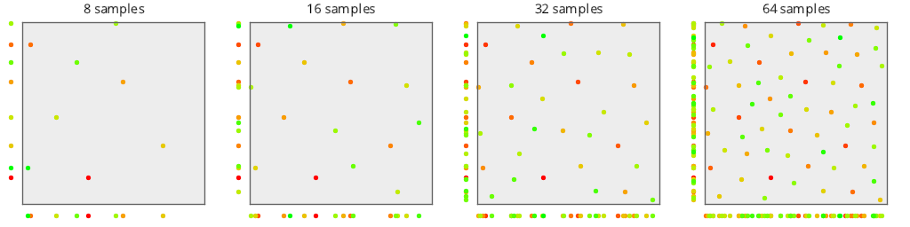
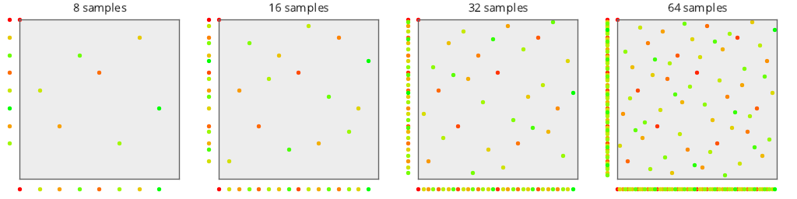

# Test Results
 tests done:
* MakePlot
## MakePlot
### Blue Noise Sequences
#### BestCandidate
  
#### BestCandidate5
  
#### BestCandidate10
  
### Low Discrepancy Sequences
#### NRooks
  
#### Hammersley
  
#### Hammersley_1Bit
  
#### Hammersley_2Bits
  
#### Sobol
  
#### Halton_2_3_Zero
  
#### Halton_2_3
  
#### Halton_5_7
  
#### Halton_13_9
  
### Uniform Random Number Sampling
#### UniformRandom
  
