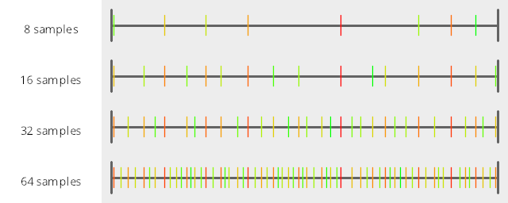
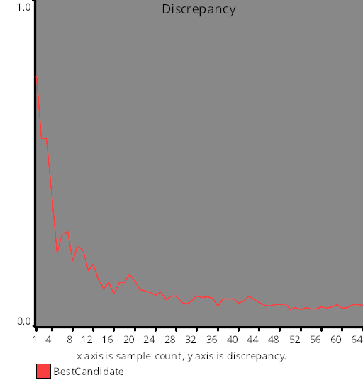
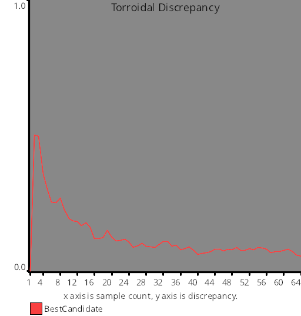
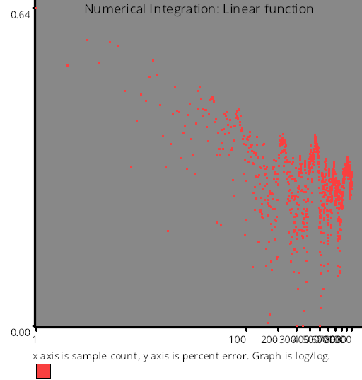
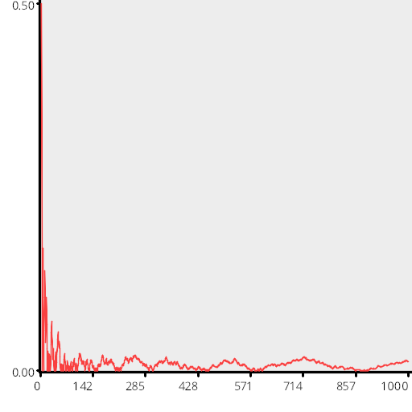
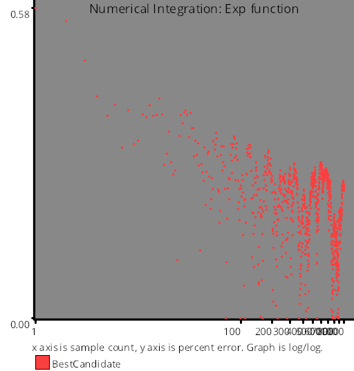

# Test Results
 samples tested:
* BestCandidate (Progressive, Randomized)
## BestCandidate
### Numberline
  
## Discrepancy Test
### CalculateDiscrepancy
  
### CalculateDiscrepancyWrapAround
  
## Numerical Integration
### Linear
  
### Step
  
### Exp
  
### Quadratic
  
