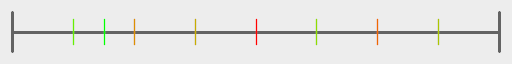
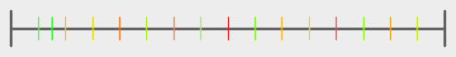
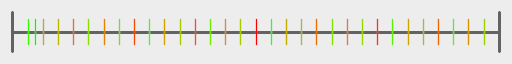
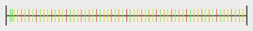

# Test Results
 samples tested:
* Sobol
## Sobol
### Discrepancy Test
#### CalculateDiscrepancy
#### CalculateDiscrepancyWrapAround
### Numerical Integration
#### Linear
### Numberline
#### MakeNumberline
8 Samples:  
  
16 Samples:  
  
32 Samples:  
  
64 Samples:  
  
