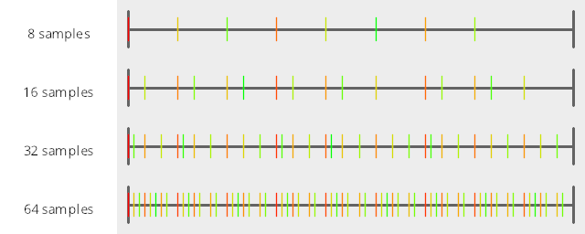
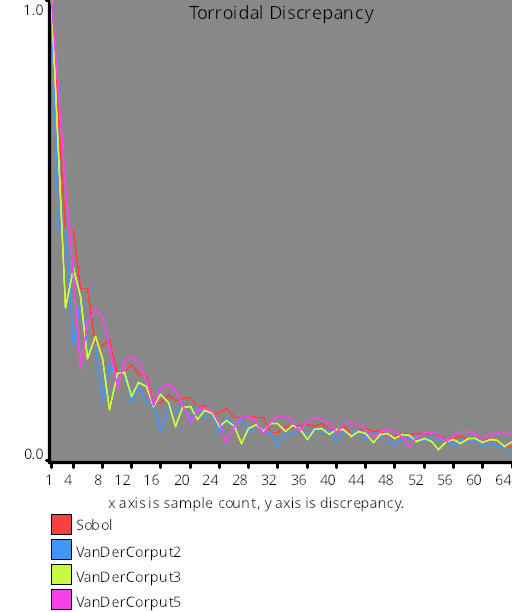
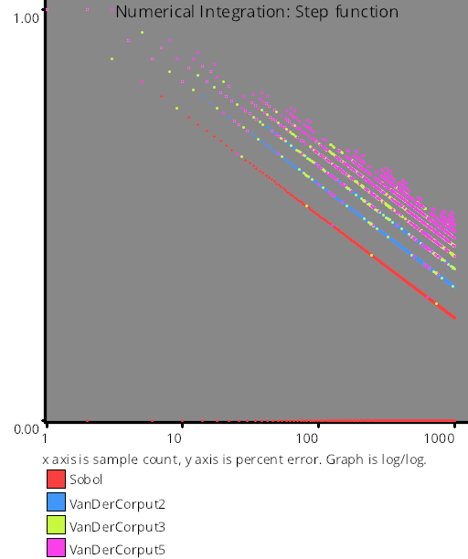

# Test Results
 samples tested:
* Sobol (Progressive, Not Randomized)
* VanDerCorput2 (Progressive, Not Randomized)
* VanDerCorput3 (Progressive, Not Randomized)
* VanDerCorput5 (Progressive, Not Randomized)
## Sobol
### Numberline
  
## VanDerCorput2
### Numberline
  
## VanDerCorput3
### Numberline
  
## VanDerCorput5
### Numberline
  
## Discrepancy Test
### CalculateDiscrepancy
  
### CalculateDiscrepancyWrapAround
  
## Numerical Integration
### Linear
  
### Step
  
### Exp
  
### Quadratic
  
