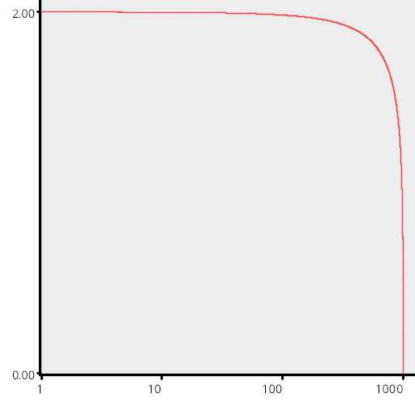
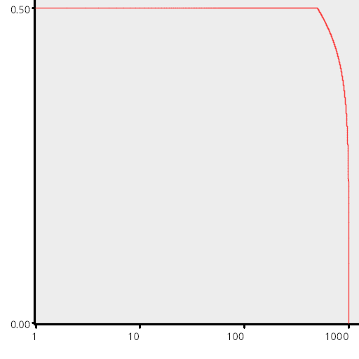
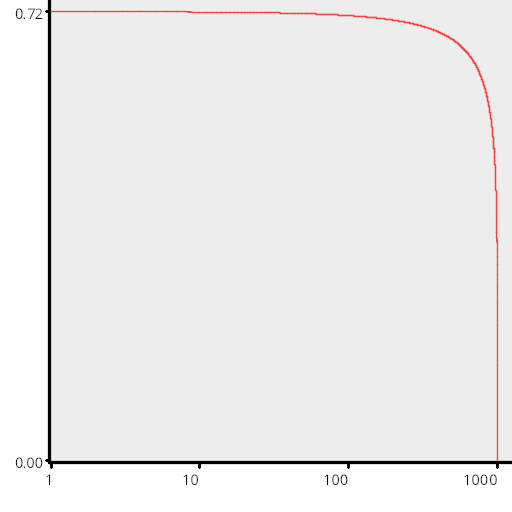
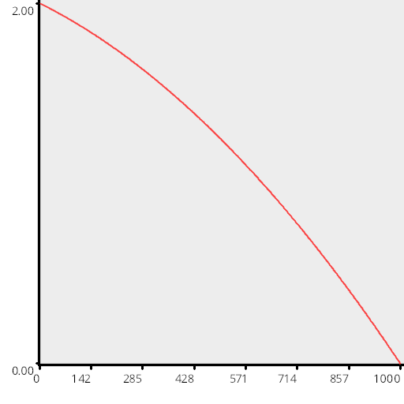
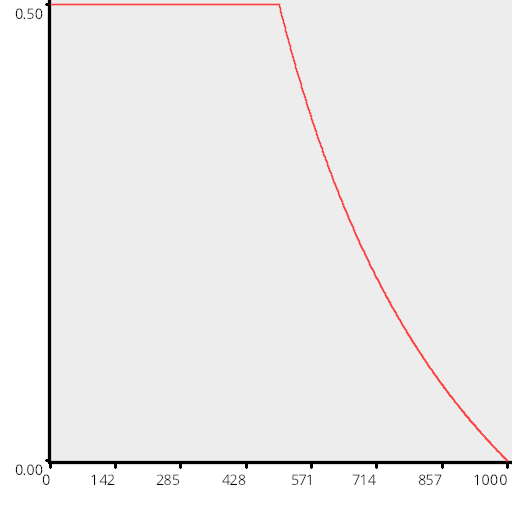
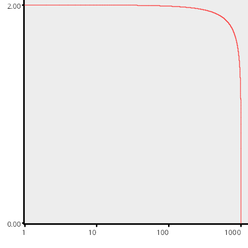

# Test Results
 samples tested:
* Regular
* RegularCentered
* RegularCenteredOffset
## Regular
### Discrepancy Test
#### CalculateDiscrepancy
#### CalculateDiscrepancyWrapAround
### Numerical Integration
#### Linear
  
#### Step
  
#### Exp
  
#### Quadratic
  
### Numberline
#### MakeNumberline
  
## RegularCentered
### Discrepancy Test
#### CalculateDiscrepancy
#### CalculateDiscrepancyWrapAround
### Numerical Integration
#### Linear
  
#### Step
  
#### Exp
  
#### Quadratic
  
### Numberline
#### MakeNumberline
  
## RegularCenteredOffset
### Discrepancy Test
#### CalculateDiscrepancy
#### CalculateDiscrepancyWrapAround
### Numerical Integration
#### Linear
  
#### Step
  
#### Exp
  
#### Quadratic
  
### Numberline
#### MakeNumberline
  
##Numerical Integration
###Linear
  
###Step
  
###Exp
  
###Quadratic
  
