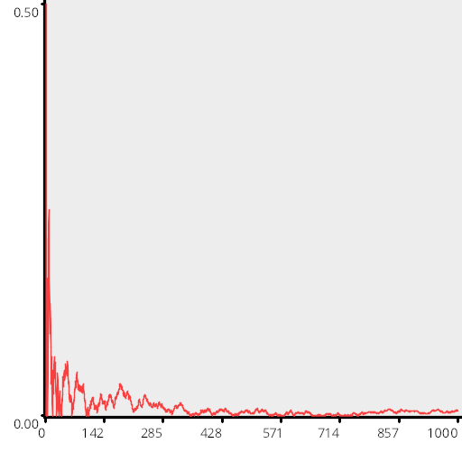
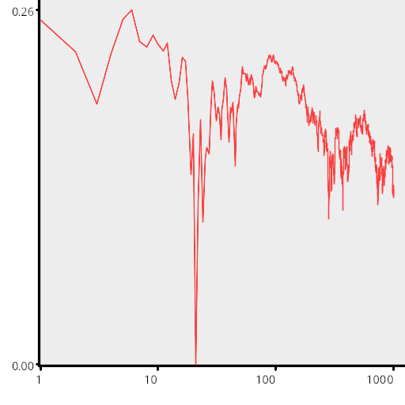
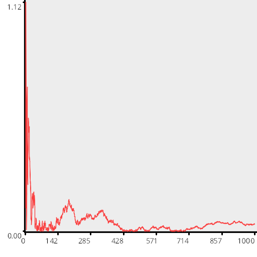

# Test Results
 samples tested:
* UniformRandom
## UniformRandom
### Discrepancy Test
#### CalculateDiscrepancy
#### CalculateDiscrepancyWrapAround
### Numerical Integration
  
#### Linear
  
#### Step
  
#### Exp
  
#### Quadratic
  
### Numberline
#### MakeNumberline
  
