# Test Results
 tests done:
* Linear
* Step
* Exp
* Quadratic
## Linear
### Blue Noise Sequences
#### BestCandidate
  
### Irrational Number Sampling
#### GoldenRatioZero
  
#### GoldenRatio
  
#### Pi
  
#### Sqrt2
  
### Low Discrepancy Sequences
#### Sobol
  
### Regular Sampling
#### Regular
  
#### RegularCentered
  
#### RegularCenteredOffset
  
### Uniform Random Number Sampling
#### UniformRandom
  
## Step
### Blue Noise Sequences
#### BestCandidate
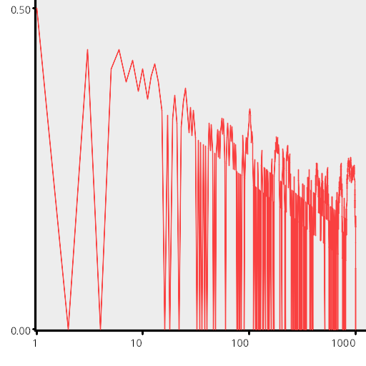  
### Irrational Number Sampling
#### GoldenRatioZero
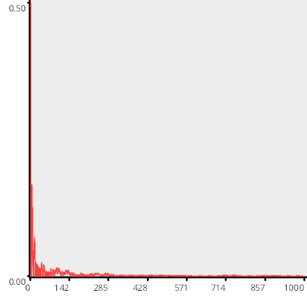  
#### GoldenRatio
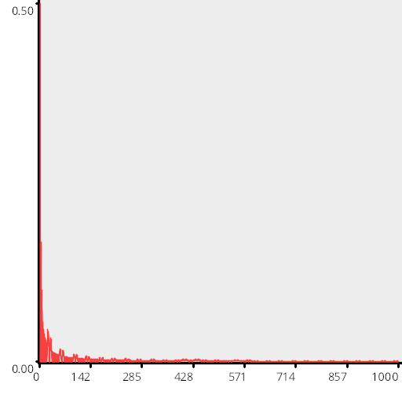  
#### Pi
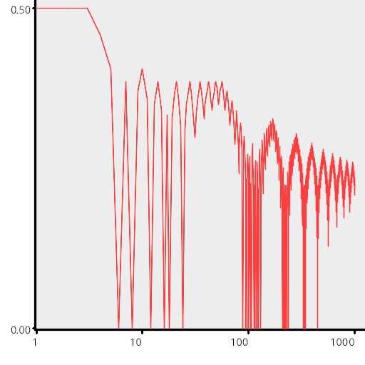  
#### Sqrt2
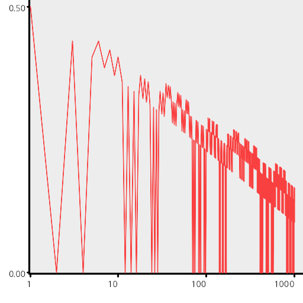  
### Low Discrepancy Sequences
#### Sobol
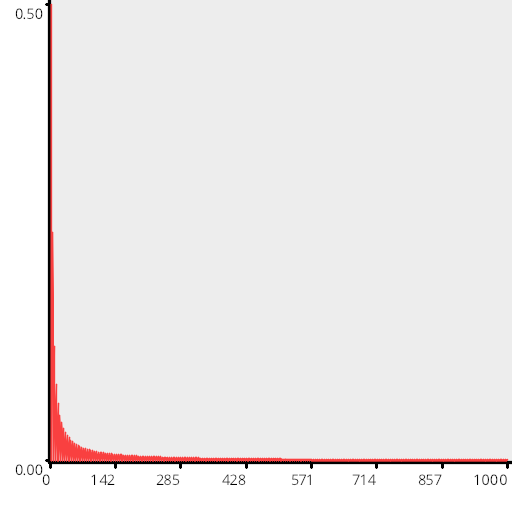  
### Regular Sampling
#### Regular
  
#### RegularCentered
  
#### RegularCenteredOffset
  
### Uniform Random Number Sampling
#### UniformRandom
  
## Exp
### Blue Noise Sequences
#### BestCandidate
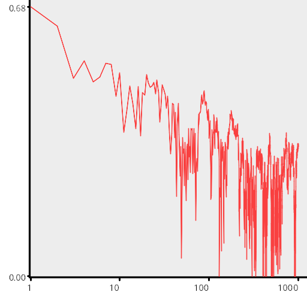  
### Irrational Number Sampling
#### GoldenRatioZero
  
#### GoldenRatio
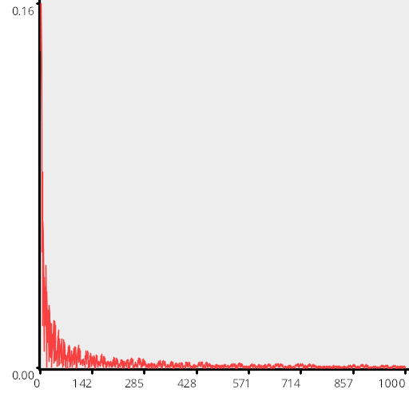  
#### Pi
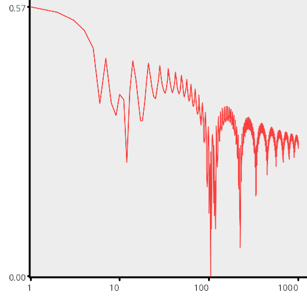  
#### Sqrt2
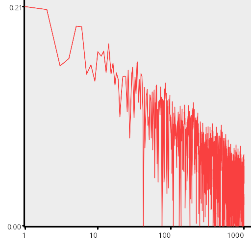  
### Low Discrepancy Sequences
#### Sobol
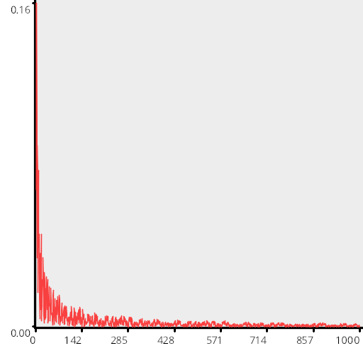  
### Regular Sampling
#### Regular
  
#### RegularCentered
  
#### RegularCenteredOffset
  
### Uniform Random Number Sampling
#### UniformRandom
  
## Quadratic
### Blue Noise Sequences
#### BestCandidate
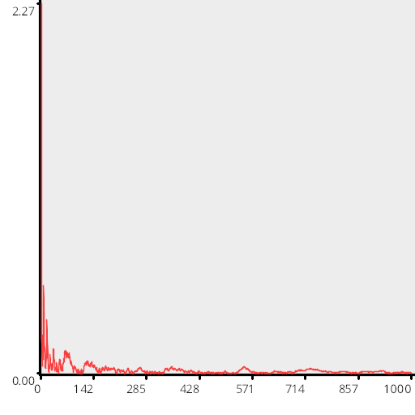  
### Irrational Number Sampling
#### GoldenRatioZero
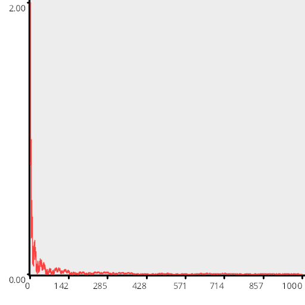  
#### GoldenRatio
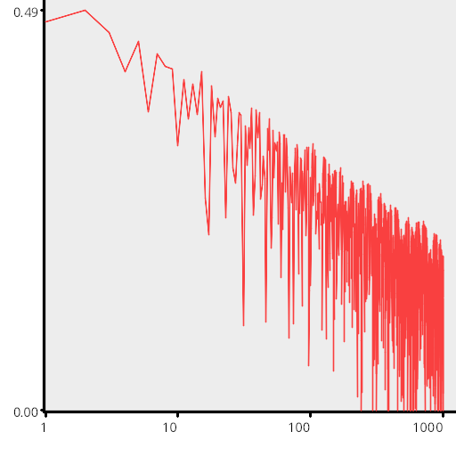  
#### Pi
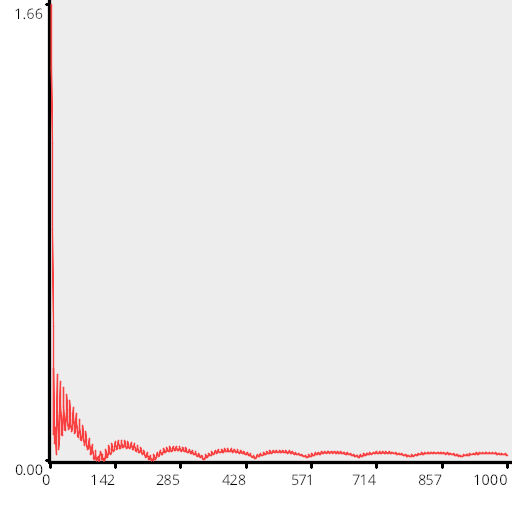  
#### Sqrt2
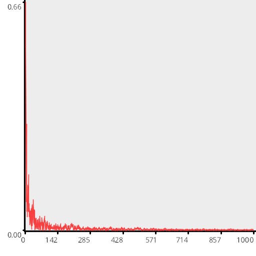  
### Low Discrepancy Sequences
#### Sobol
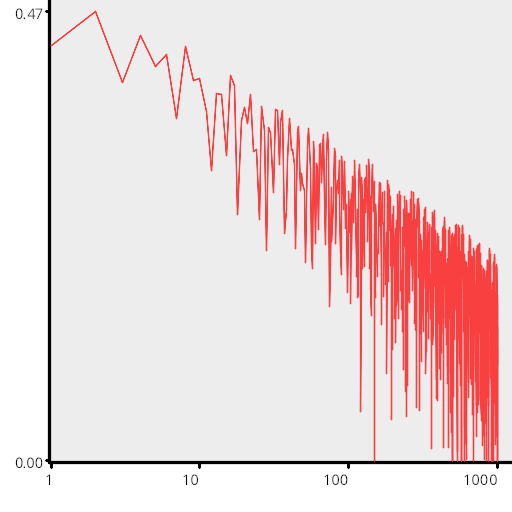  
### Regular Sampling
#### Regular
  
#### RegularCentered
  
#### RegularCenteredOffset
  
### Uniform Random Number Sampling
#### UniformRandom
  
