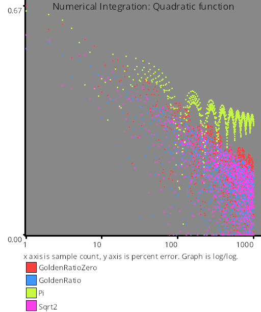

# Test Results
 tests done:
* Linear
* Step
* Exp
* Quadratic
## Linear
### Blue Noise Sequences
  
#### BestCandidate
### Irrational Number Sampling
  
#### GoldenRatioZero
#### GoldenRatio
#### Pi
#### Sqrt2
### Low Discrepancy Sequences
  
#### Sobol
### Regular Sampling
  
#### Regular
#### RegularCentered
#### RegularCenteredOffset
### Uniform Random Number Sampling
  
#### UniformRandom
## Step
### Blue Noise Sequences
  
#### BestCandidate
### Irrational Number Sampling
  
#### GoldenRatioZero
#### GoldenRatio
#### Pi
#### Sqrt2
### Low Discrepancy Sequences
  
#### Sobol
### Regular Sampling
  
#### Regular
#### RegularCentered
#### RegularCenteredOffset
### Uniform Random Number Sampling
  
#### UniformRandom
## Exp
### Blue Noise Sequences
  
#### BestCandidate
### Irrational Number Sampling
  
#### GoldenRatioZero
#### GoldenRatio
#### Pi
#### Sqrt2
### Low Discrepancy Sequences
  
#### Sobol
### Regular Sampling
  
#### Regular
#### RegularCentered
#### RegularCenteredOffset
### Uniform Random Number Sampling
  
#### UniformRandom
## Quadratic
### Blue Noise Sequences
  
#### BestCandidate
### Irrational Number Sampling
  
#### GoldenRatioZero
#### GoldenRatio
#### Pi
#### Sqrt2
### Low Discrepancy Sequences
  
#### Sobol
### Regular Sampling
  
#### Regular
#### RegularCentered
#### RegularCenteredOffset
### Uniform Random Number Sampling
  
#### UniformRandom
