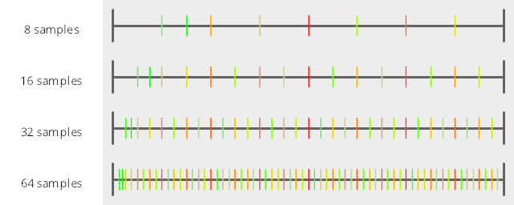

# Numberline
The MakeNumberline() function makes a numberline image from the samples you give it, and writes it to disk as a png, with the specified filename.

The first sample is red and the last sample is green. This lets you see the order of the samples on the numberline.
# Test Results
 tests done:
* MakeNumberline
## MakeNumberline
### Blue Noise Sequences
#### BestCandidate
  
### Irrational Number Sampling
#### GoldenRatioZero
  
#### GoldenRatio
  
#### Pi
  
#### Sqrt2
  
### Low Discrepancy Sequences
#### Sobol
  
### Regular Sampling
#### Regular
  
#### RegularCentered
  
#### RegularCenteredOffset
  
### Uniform Random Number Sampling
#### UniformRandom
  
