# Test Results
 tests done:
* MakeNumberline
## MakeNumberline
### Blue Noise Sequences
#### BestCandidate
8 Samples:  
  
16 Samples:  
  
32 Samples:  
  
64 Samples:  
  
### Irrational Number Sampling
#### GoldenRatioZero
8 Samples:  
  
16 Samples:  
  
32 Samples:  
  
64 Samples:  
  
#### GoldenRatio
8 Samples:  
  
16 Samples:  
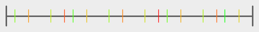  
32 Samples:  
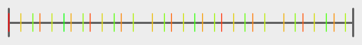  
64 Samples:  
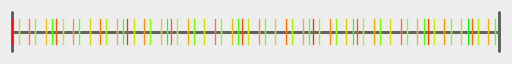  
#### Pi
8 Samples:  
  
16 Samples:  
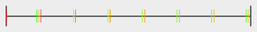  
32 Samples:  
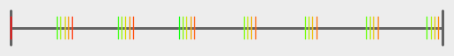  
64 Samples:  
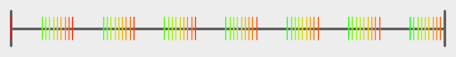  
#### Sqrt2
8 Samples:  
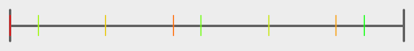  
16 Samples:  
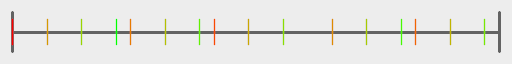  
32 Samples:  
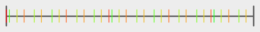  
64 Samples:  
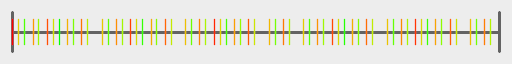  
### Low Discrepancy Sequences
#### Sobol
8 Samples:  
  
16 Samples:  
  
32 Samples:  
  
64 Samples:  
  
### Regular Sampling
#### Regular
8 Samples:  
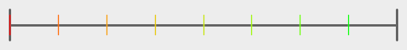  
16 Samples:  
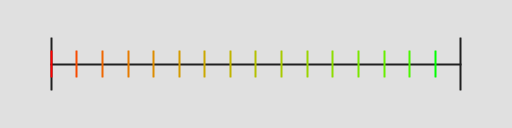  
32 Samples:  
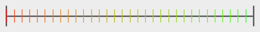  
64 Samples:  
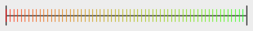  
#### RegularCentered
8 Samples:  
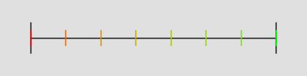  
16 Samples:  
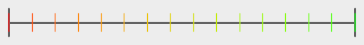  
32 Samples:  
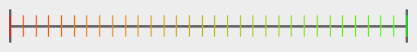  
64 Samples:  
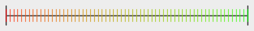  
#### RegularCenteredOffset
8 Samples:  
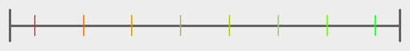  
16 Samples:  
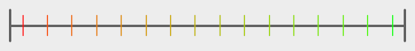  
32 Samples:  
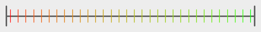  
64 Samples:  
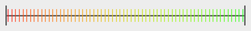  
### Uniform Random Number Sampling
#### UniformRandom
8 Samples:  
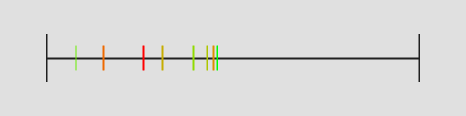  
16 Samples:  
  
32 Samples:  
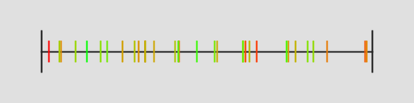  
64 Samples:  
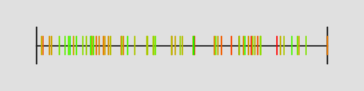  
