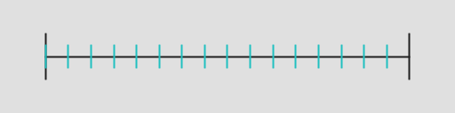
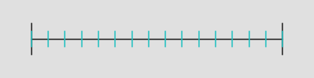
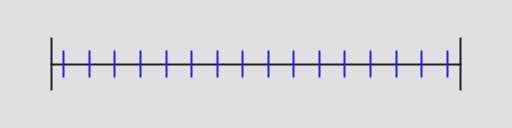

# Regular Sampling

**namespace:** Samples::_1d::Regular

Regular sampling is also known as uniformly spaced sampling, regular grid sampling.

This sampling strategy takes samples at even spaces which can show good convergence, but comes at the cost of aliasing.

Randomized sampling is often favored over regularly spaced samples to get rid of aliasing problems, at the cost of gaining noise.

There are three regular sampling strategies supplied:
* Regular()
* RegularCentered()
* RegularCenteredOffset()

## Regular()

This does evenly spaced sampling starting at 0 and going to (N-1)/N, in step sizes of 1/N.

If N is 4, the sampling pattern is:  0, 1/4, 2/4, 3/4.

A problem here is that if you take the average of those numbers, you get 0.375, instead of 0.5 like you might expect.  That can affect the quality of the sampling.

16 samples:

## RegularCentered()

This does evenly spaced sampling, starting at 0 and going to 1, in step sizes of 1/(N-1).

If N is 4, the sampling pattern is: 0, 1/3, 2/3, 1.

Averaging those values gives 0.5.

If you are sampling something that gives the same meaning to 0 and 1 (when it wraps around, or is toroidal), a problem with this sequence is that it has 2 samples in the same location, so weights that sample more highly (adding bias), and also gives less sampling coverage over the sampling domain, which affects the quality of the sampling.

16 samples:

## RegularCenteredOffset()

This is the same pattern as Regular, but adds 1/(n*2) to each sample position.

If N is 4, the sampling pattern is: 1/8, 3/8, 5/8, 7/8.

Averaging those values gives 0.5.

If you are sampling something that gives the same meanting to 0 and 1, this sequence has N distinct sample locations and the distance between all of the samples is a constant 1/N.

16 samples:

