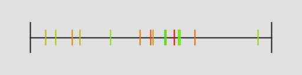

# Uniform Random Sampling

**namespace:** Samples::_1d::UniformRandom

Uniform random sampling uses random numbers to make sample positions.

It's called uniform because it uses a uniform distribution of random numbers.

This is also known as "white noise" because if you look at the DFT, it has equal probability of having amplitudes in all frequencies.

This is in contrast to blue noise which only has high frequency content or red noise which only has low frequency content.

Uniform random sampling doesn't have the aliasing problems that regular sampling does, but instead introduces noise.

A problem with white noise is that the point locations are completely random without regard to any of the other point locations, which means that white noise samples can clump together and leave holes.

The end result is that uniform random sampling is not very quick at numerical integration, and before it converges it can have a very noticeable and jarring noise pattern.

Here are 16 samples of uniform random samples:

