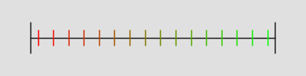

The MakeNumberline() function makes a numberline image from the samples you give it, and writes it to disk as a png, with the specified filename.

Here is an example numberline of 16 samples made with Samples::_1d::Regular::RegularCenteredOffset()

